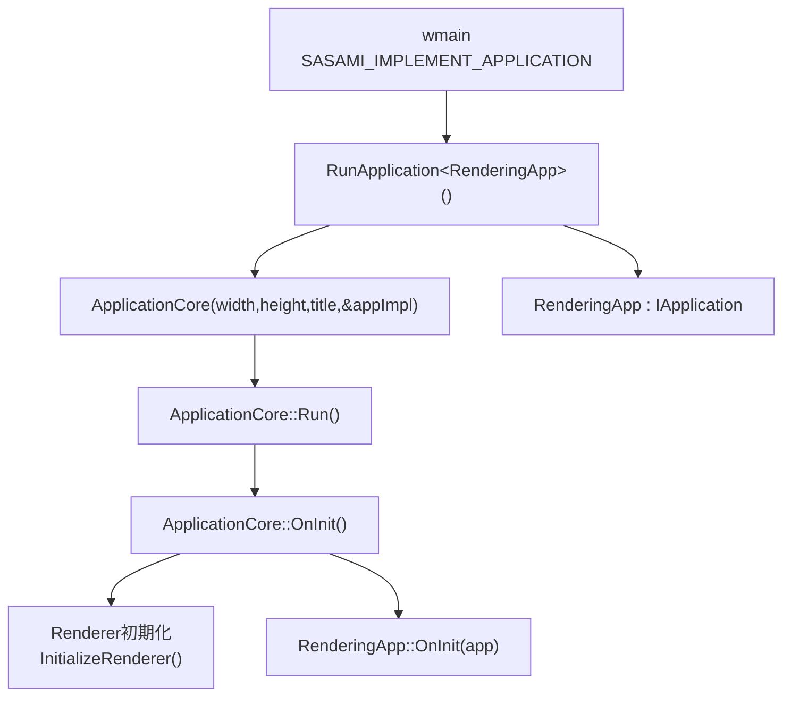
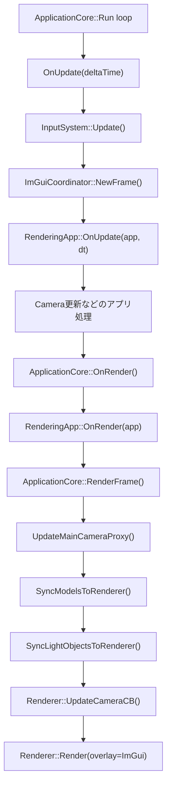
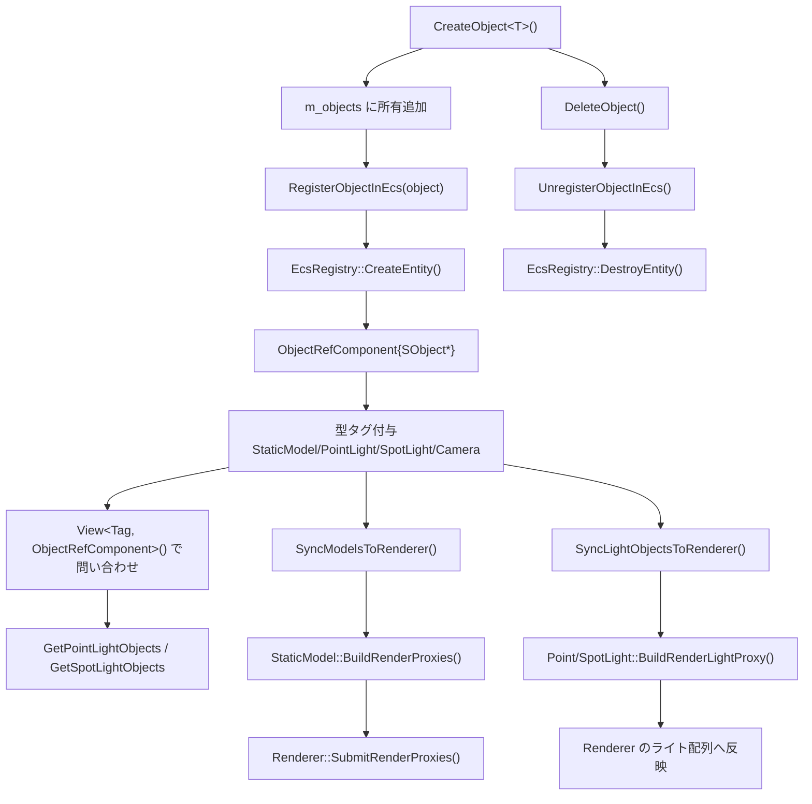
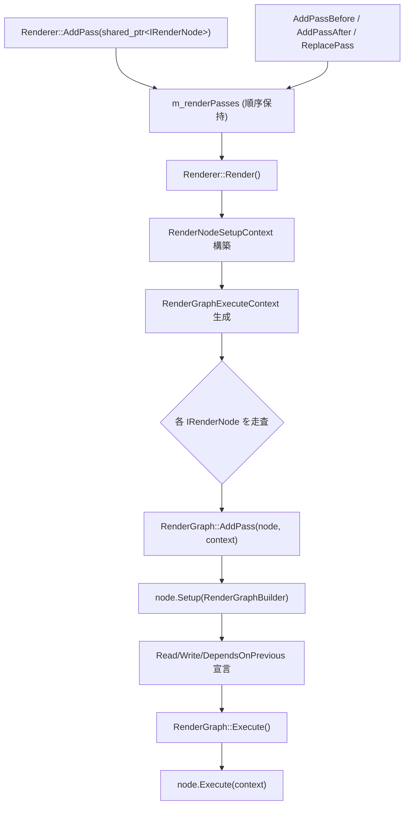
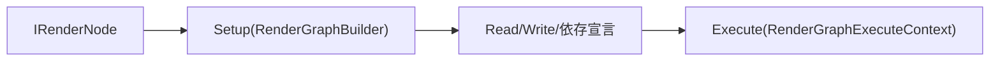

# Sasami DX12 Renderer

DirectX 12 ベースのレンダラ実験プロジェクトです。現在は以下の3プロジェクト構成です。

- `SasamiRenderer` (`.lib`): レンダラ本体（RHI抽象 + DX12実装 + 描画パス）
- `AppFramework` (`.lib`): アプリループ、入力、カメラ、モデルローダ、ImGui統合
- `PBRApp` (`.exe`): サンプルアプリ（Sponza + Bunny、ライティングUI）

詳細な設計は `ARCHITECTURE.md` を参照してください。

## 3レイヤー全体フロー（Application / Renderer / 独自Application）

このリポジトリの実行時は、次の3レイヤーで責務を分離しています。

- 独自Application層（`PBRApp`）: `RenderingApp : IApplication` がゲーム/サンプル固有ロジックを持つ
- Application層（`AppFramework`）: `ApplicationCore` がウィンドウ、メインループ、入力、ECS、Renderer連携を持つ
- Renderer層（`SasamiRenderer`）: `Renderer` がGPUリソースとレンダーノード実行を持つ



### フレーム実行フロー（3レイヤー接続）



### Application層のECSフロー

`ApplicationCore` は `std::vector<std::unique_ptr<SObject>>` でオブジェクトを所有しつつ、`EcsRegistry` にエンティティ/タグを登録して問い合わせと同期を行います。



## Renderer層レンダーノードフロー（IRenderNode + RenderGraph）

現在は「`AddPass` で `IRenderNode` を直接積む -> `RenderGraph::AddPass` で登録 -> `Execute(context)` 実行」の一本化構成です。  
Builtin/Custom の区別はなく、同一の `IRenderNode` 経路で順序実行されます。



### 1ノード実行フロー（Renderer::Render内）



### フロー上の要点

- `AddPass` にパスクラスを渡すだけで登録できます。
- 必要なら `AddPassBefore/After` と `ReplacePass` で順序を動的に編集できます。
- GBuffer/SceneColor/ShadowMap などの依存は、`Setup(RenderGraphBuilder)` の `Read/Write` で宣言できます。
- `RenderGraph` は `DependsOn` と Read/Write 競合から実行順を構築します。
- すべてのノードは `IRenderNode` で同一実行経路に参加します（個別アダプタ分岐なし）。

## Requirements

- Windows 10/11
- Visual Studio 2022 (MSVC, C++20)
- Windows SDK + Graphics Tools（D3D12 Debug Layer）
- NuGet パッケージ復元
- Boost headers (`boost/signals2`) が参照可能であること
  - 例: `BOOST_ROOT` / `BOOST_INCLUDEDIR` 環境変数
  - または `C:\local\boost_1_89_0`

## Build

### Visual Studio

1. `SasamiRenderer.sln` を開く
2. `x64` + `Debug` か `Release` を選択
3. `PBRApp` をスタートアッププロジェクトに設定して実行

### MSBuild (Developer Command Prompt)

```bat
nuget restore SasamiRenderer.sln
msbuild PBRApp.vcxproj /p:Configuration=Debug /p:Platform=x64
```

Release の場合:

```bat
msbuild PBRApp.vcxproj /p:Configuration=Release /p:Platform=x64
```

生成物は `Build/bin/<Platform>/<Configuration>/` に出力されます。

## Run

`PBRApp.exe` を起動するとサンプルシーンを描画します。ImGui で以下を操作できます。

- Camera: 移動速度、Near/Far Clip
- Lighting: Directional/Point/Spot ライト
- Render: Tessellation + Geometry Shader 切り替え
- Render: `GBuffer Debug` 表示切り替え（`Final Lit / Albedo / Normal / Roughness / Metallic / AO / Shadow`）
  - ショートカット: `F2` で循環切り替え

## Repository Layout

- `Source/Renderer/Core/`: renderer本体、RHI抽象、DX12デバイス実装、パイプライン設定
- `Source/Renderer/Scene/`: `RenderProxy`、`MeshBuffer`、描画コマンド構築
- `Source/Renderer/Assets/`: テクスチャ/HDR/キューブマップ読み込み・GPUテクスチャ生成
- `Source/Renderer/Utilities/`: ライティング計算、IBL生成などのレンダリング補助計算
- `Source/Renderer/Structures/`: renderer専用の軽量データ構造（`Float3` など）
- `Source/Renderer/Shaders/`: HLSL
- `Source/AppFramework/`: app loop, input, camera, model loading, ImGui
- `Samples/PBRApp/`: sample app implementation
- `Assets/`: models/textures
- `Libraries/`: third-party dependencies
- `Build/`: build outputs (`bin/`, `obj/`)

## Notes

- 現在の実装バックエンドは DX12 のみです（Vulkan/DX11/OpenGL は未実装スタブ）。
- アイコン/空/IBL の探索パスは、`Renderer` 内の既定値として `Assets/` 配下の固定パスを使用します。
- サンプルアプリのエントリポイントは `SASAMI_IMPLEMENT_APPLICATION(...)` マクロで定義しています。
- 実行時デバッグは Visual Studio Output の D3D12 メッセージを参照してください。
