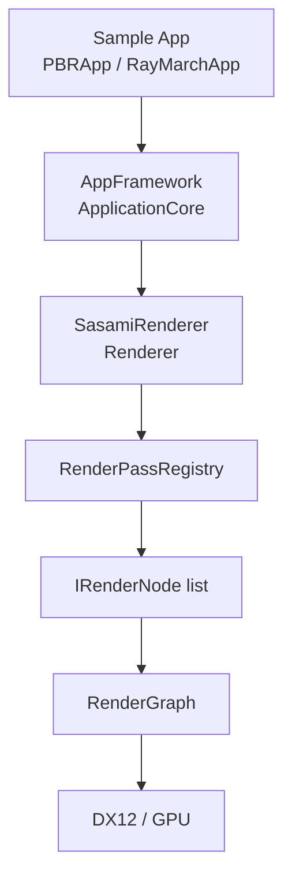
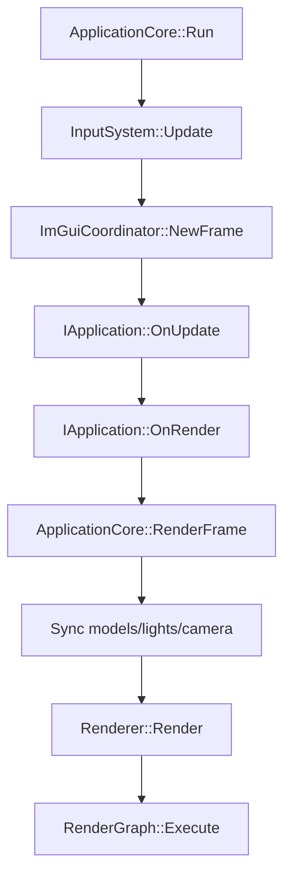

# Sasami DX12 Renderer

DirectX 12 を中心にしたレンダラ実験プロジェクトです。この README は 2026-05-04 時点でリポジトリ内に存在する実装を確認して更新しています。未確認の性能値や対応予定は記載していません。

## Project Status

ソリューションは 4 プロジェクト構成です。

| プロジェクト | 種別 | 役割 |
| --- | --- | --- |
| `SasamiRenderer` | static library | RHI 抽象、DX12 実装、レンダーグラフ、レンダーノード、シーン/ライト/GPU リソース管理 |
| `AppFramework` | static library | Win32 アプリループ、入力、カメラ、簡易 ECS、モデル/アセット読み込み、ImGui 統合 |
| `PBRApp` | executable | Sponza/Bunny/プリミティブを使う PBR サンプル |
| `RayMarchApp` | executable | `RayMarchRenderNode` 単体で動かすレイマーチングサンプル |

現在の既定 RHI は `RHI_DIRECTX12=1` です。`GraphicsDevice.h` には RHI 抽象とバックエンド選択用マクロがありますが、現行実装として確認できる具象デバイスは `Dx12GraphicsDevice` です。

## Implemented Features

- レンダーノード方式の描画パイプライン
  - 既定順序は `Shadow -> Opaque -> RuntimeAO -> Lighting -> Skybox -> Transparent -> TransparentLighting -> PostProcess`
  - `AddPass` / `AddPassBefore` / `AddPassAfter` / `ReplacePass` で `IRenderNode` を差し替え可能
  - `RenderPassRegistry` が組み込みノードと実行順を管理
- RenderGraph
  - 各ノードが `Setup(RenderGraphBuilder)` で Read/Write/依存を宣言
  - `RenderGraph` が依存関係を解決して `Execute(RenderNodeContextView)` を呼び出す
  - `IRenderNode::PreferredQueue()` による Graphics/Compute 希望キュー指定に対応
- Raster/PBR
  - GBuffer、PBR Lighting、Skybox、Transparent/TransparentLighting、PostProcess
  - Tessellation、Geometry Shader、Mesh Shader 用メッシュレット生成と Meshlet Debug View
  - GBuffer Debug View: `FinalLit / Albedo / Normal / Roughness / Metallic / AmbientOcclusion / Shadow / Emissive / Runtime AO Raw / Runtime AO Filtered / DirectionalLight`
- Ambient Occlusion
  - Runtime AO はランタイム生成 AO の総称で、現在は SSAO と RTAO（SWRT AO）を選択可能
  - SSAO + bilateral blur
  - RTAO via SWRT
  - `AmbientOcclusionMode`: `MaterialOnly / RuntimeAOOnly / RayTracedAOOnly / Hybrid`
  - `RuntimeAmbientOcclusionMethod`: `SSAO / RayTraced`
  - UE の Min Occlusion 相当の下限値設定
- Software Ray Tracing (SWRT)
  - CPU 構築 BVH/TLAS を GPU にアップロードし、Compute Shader で影・反射・AO を実行
  - Legacy reflection と ReSTIR DI モード
  - Reflection denoiser 設定: temporal alpha、A-Trous iteration、depth phi
  - ReSTIR 関連シェーダ: `SWRT_ReSTIR_*`, `SWRT_Reservoir.hlsli`, `SWRT_Shadow_ReSTIR_CS.hlsl`
  - `SWRT_Reflection_ATrous_CS.hlsl` は作業ツリー上では未追跡ファイルとして存在します
- Hardware Ray Tracing (DXR)
  - `DxrRayTracer` と `RayTracing.hlsl`
  - BLAS/TLAS、RayGen/ClosestHit/Miss/ShadowMiss シェーダ構成
  - `RenderPathMode::HardwareRayTracing` と GPU 対応チェックに基づく実行
- Global Illumination
  - `IrradianceProbeGrid`
  - `GI_ProbeUpdate_CS.hlsl`
  - Probe Grid Debug 表示用 `DebugProbeGridRenderNode`
- Sky / Cloud / Ray Marching
  - HDR/LDR equirect skybox 読み込み
  - LDR cubemap face skybox 読み込み（`px/nx/py/ny/pz/nz` などの 6 面ディレクトリ）
  - `ProceduralSkyRenderNode`
  - `SdfFluidRenderNode` と `RenderPathMode::SdfFluid`
  - `VolumetricCloudRenderNode` と `VolumetricCloud_*` シェーダ。API/UI で有効化すると PBR パスへ自動挿入
  - `RayMarchRenderNode` と `RayMarchApp`
- Asset / Scene
  - glTF 読み込み、WIC 画像読み込み、Radiance HDR 読み込み
  - `StaticModel` の glTF/プリミティブ生成
  - Directional/Point/Spot light と UI ギズモ

## Current Caveats

- 現行で実装されている具象 RHI は DirectX 12 です。`GraphicsRuntime::Vulkan` / `DirectX11` / `OpenGL` の選択肢はありますが、バックエンド実装はまだありません。
- Hardware RT と Mesh Shader は GPU/ドライバ機能に依存します。未対応環境では DXR は Raster へ戻り、Mesh Shader パスはスキップされます。
- `x64 Debug` の `PBRApp.vcxproj` は 2026-05-04 に MSBuild で確認済みです。

## Build

### Requirements

- Windows 10/11
- Visual Studio 2022 / MSVC C++20
- Windows SDK
- Windows Optional Feature の Graphics Tools（D3D12 Debug Layer を使う場合）
- NuGet パッケージ復元
- Boost headers (`boost/signals2`)
  - `BOOST_ROOT` / `BOOST_INCLUDEDIR`
  - またはプロジェクト設定にある `C:\local\boost_1_89_0`
- `Libraries/NRD/_Bin/<Configuration>` に `NRD.lib` / `NRI.lib` があること

### Visual Studio

1. `SasamiRenderer.sln` を開く
2. `x64` + `Debug` または `Release` を選択
3. 実行したいサンプルをスタートアッププロジェクトに設定
   - `PBRApp`
   - `RayMarchApp`
4. `F5` で実行

### MSBuild

Developer Command Prompt で実行します。

```bat
nuget restore SasamiRenderer.sln
msbuild SasamiRenderer.sln /p:Configuration=Debug /p:Platform=x64
```

個別にビルドする場合:

```bat
msbuild PBRApp.vcxproj /p:Configuration=Debug /p:Platform=x64
msbuild RayMarchApp.vcxproj /p:Configuration=Debug /p:Platform=x64
```

出力先は各 `.vcxproj` の設定により `Build/bin/<Platform>/<Configuration>/` です。

## Run

### PBRApp

`PBRApp` は `Samples/PBRApp/RenderingApp.cpp` のサンプルシーンを起動します。

- HDR skybox: `Assets/HDR/citrus_orchard_road_puresky_4k.hdr`
- Models:
  - `Assets/Models/stanford_bunny_pbr/scene.gltf`
  - `Assets/Models/Sponza/glTF/Sponza.gltf`
- 追加プリミティブ:
  - metal sphere
  - metal box
  - transparent sphere
  - transparent box
  - floor
- ImGui:
  - Camera
  - Lighting
  - Render settings
  - Material editor
  - GI/Probe debug
  - SWRT/RT 関連設定

### RayMarchApp

`RayMarchApp` は起動時に既定パスをクリアし、`RayMarchRenderNode` だけを登録します。

- Camera mode: `RayMarch`
- UI:
  - camera speed
  - cloud cover / density
  - distance heatmap
  - wave LOD debug
  - cone march debug

## Architecture

実行時は 3 層構成です。



フレームの大まかな流れ:



`ApplicationCore` は `SObject` を所有し、`EcsRegistry` に型タグと `ObjectRefComponent` を登録します。モデルとライトは毎フレーム `RenderProxy` / `RenderLightProxy` に変換され、`Renderer` に同期されます。

## Important Files

| パス | 内容 |
| --- | --- |
| `Source/Renderer/Core/Renderer.h/.cpp` | レンダラ本体、ノード登録、フレーム実行、リソース同期 |
| `Source/Renderer/Core/RenderGraph.h/.cpp` | レンダーグラフ、依存解決、実行 |
| `Source/Renderer/Core/RenderPassRegistry.h/.cpp` | 組み込みノードと実行順管理 |
| `Source/Renderer/Core/RenderSettings.h` | 描画設定の POD |
| `Source/Renderer/Core/RenderTargetPool.h/.cpp` | BackBuffer/GBuffer/Runtime AO/SWRT/RT 用テクスチャ管理 |
| `Source/Renderer/Core/Dx12GraphicsDevice.h/.cpp` | DX12 デバイス、Graphics/Compute queue、swap chain |
| `Source/Renderer/Passes/` | 各 `IRenderNode` 実装 |
| `Source/Renderer/RayTracing/` | SWRT/DXR/シーン加速構造関連 |
| `Source/Renderer/GI/` | Irradiance Probe Grid |
| `Source/Renderer/Scene/` | MeshBuffer、MeshletBuffer、SceneSubmitter、LightSystem、Skybox |
| `Source/Renderer/Shaders/` | HLSL シェーダ |
| `Source/AppFramework/` | アプリ基盤、入力、モデルローダ、ImGui、ECS |
| `Samples/PBRApp/` | PBR サンプル |
| `Samples/RayMarchApp/` | レイマーチングサンプル |
| `Assets/` | サンプルモデル、テクスチャ、HDR |
| `Libraries/` | imgui、rapidjson、NRD、DXC など |
| `Tools/DXC/` | 同梱 DXC |

## Shader Layout

- `Source/Renderer/Shaders/CookTorranceGGX_*`: PBR lighting
- `Source/Renderer/Shaders/Opaque_*`: opaque pass
- `Source/Renderer/Shaders/Tessellation_*`: tessellation path
- `Source/Renderer/Shaders/Skybox/`: skybox
- `Source/Renderer/Shaders/SSAO/`: Runtime AO の SSAO 実装と blur
- `Source/Renderer/Shaders/SWRT/`: software ray tracing compute shaders
- `Source/Renderer/Shaders/RayTracing/`: DXR shader
- `Source/Renderer/Shaders/GI/`: GI probe update
- `Source/Renderer/Shaders/Debug/`: debug probe grid, meshlet/tessellation debug shaders
- `Source/Renderer/Shaders/ProceduralSky/`: procedural sky
- `Source/Renderer/Shaders/SdfFluid/`: SDF fluid renderer
- `Source/Renderer/Shaders/RayMarch/`: RayMarch sample
- `Source/Renderer/Shaders/VolumetricCloud/`: volumetric cloud

## Development Notes

- 変更前に `git status --short` で作業ツリーを確認してください。現時点では README 以外にも未コミット変更があります。
- `x64/`, `.vs/`, `*.user`, 生成済みバイナリはコミット対象にしない方針です。
- シェーダは Debug/Release の両方で `/WX` 相当の警告エラー扱いを維持してください。
- D3D12 の不具合調査では Debug Layer と GPU-based validation を有効化してください。
