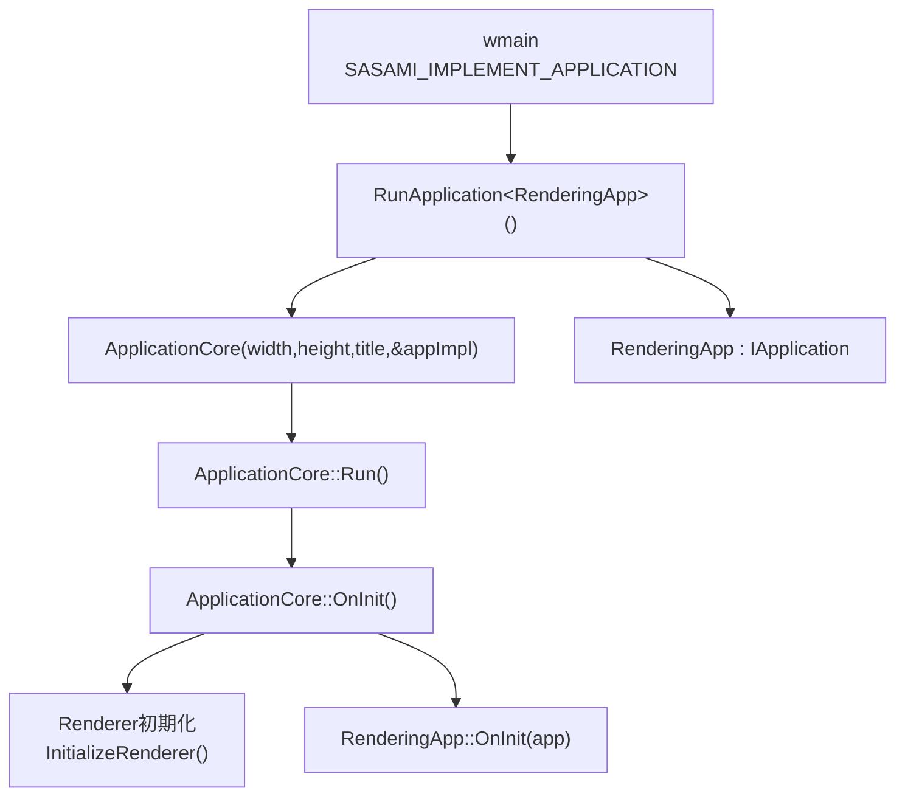
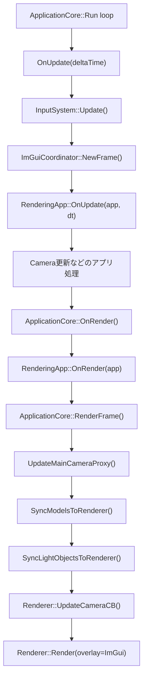
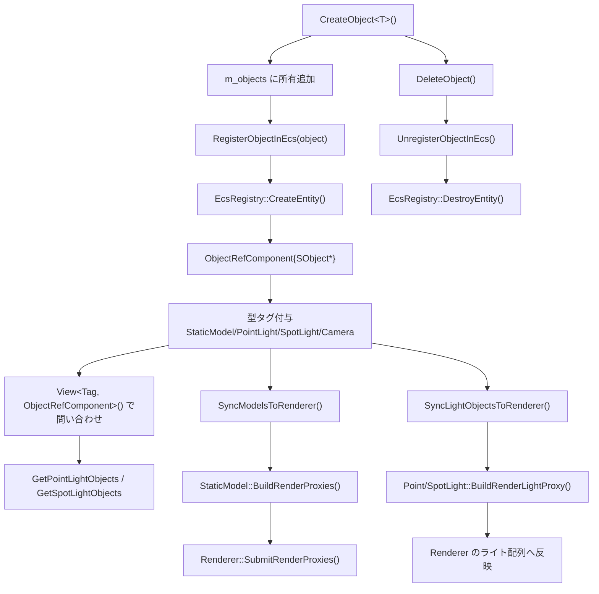
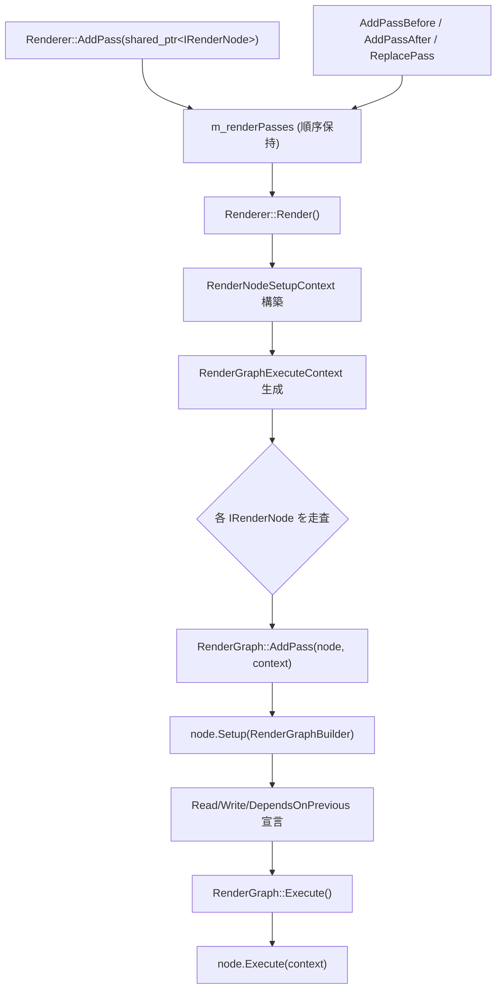
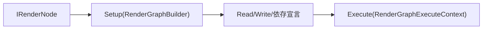

# Sasami DX12 Renderer

DirectX 12 ベースのレンダラ実験プロジェクトです。現在は以下の3プロジェクト構成です。

- `SasamiRenderer` (`.lib`): レンダラ本体（RHI抽象 + DX12実装 + 描画パス）
- `AppFramework` (`.lib`): アプリループ、入力、カメラ、モデルローダ、ImGui統合
- `PBRApp` (`.exe`): サンプルアプリ（Sponza + Bunny、ライティングUI）

詳細な設計は `ARCHITECTURE.md` を参照してください。

## 3レイヤー全体フロー（Application / Renderer / 独自Application）

このリポジトリの実行時は、次の3レイヤーで責務を分離しています。

- 独自Application層（`PBRApp`）: `RenderingApp : IApplication` がゲーム/サンプル固有ロジックを持つ
- Application層（`AppFramework`）: `ApplicationCore` がウィンドウ、メインループ、入力、ECS、Renderer連携を持つ
- Renderer層（`SasamiRenderer`）: `Renderer` がGPUリソースとレンダーノード実行を持つ



### フレーム実行フロー（3レイヤー接続）



### Application層のECSフロー

`ApplicationCore` は `std::vector<std::unique_ptr<SObject>>` でオブジェクトを所有しつつ、`EcsRegistry` にエンティティ/タグを登録して問い合わせと同期を行います。



## Renderer層レンダーノードフロー（IRenderNode + RenderGraph）

現在は「`AddPass` で `IRenderNode` を直接積む -> `RenderGraph::AddPass` で登録 -> `Execute(context)` 実行」の一本化構成です。  
Builtin/Custom の区別はなく、同一の `IRenderNode` 経路で順序実行されます。



### 1ノード実行フロー（Renderer::Render内）



### フロー上の要点

- `AddPass` にパスクラスを渡すだけで登録できます。
- 必要なら `AddPassBefore/After` と `ReplacePass` で順序を動的に編集できます。
- GBuffer/SceneColor/ShadowMap などの依存は、`Setup(RenderGraphBuilder)` の `Read/Write` で宣言できます。
- `RenderGraph` は `DependsOn` と Read/Write 競合から実行順を構築します。
- すべてのノードは `IRenderNode` で同一実行経路に参加します（個別アダプタ分岐なし）。

## Renderer コアクラス構成

`Renderer` クラスは以下のサポートクラスに責務を委譲します。

| クラス | ファイル | 役割 |
|--------|---------|------|
| `RenderSettings` | `Source/Renderer/Core/RenderSettings.h` | 全レンダリングパラメータを保持する POD 構造体（IBL 強度、テッセレーション、SSAO、SWRT、レイトレーシング設定など） |
| `RenderTargetPool` | `Source/Renderer/Core/RenderTargetPool.h/cpp` | フレームサイズ GPU テクスチャ（GBuffer・SSAO・Depth・SWRT テクスチャ・バックバッファ・RT 出力）の所有と管理 |
| `SWRTExecutor` | `Source/Renderer/RayTracing/SWRTExecutor.h/cpp` | SWRT（GPU Compute BVH）とハードウェア DXR の実行、部分更新キャッシュ管理（影・リフレクションのフレームスキップ、シーンバージョン追跡） |
| `SceneSubmitter` | `Source/Renderer/Scene/SceneSubmitter.h/cpp` | レンダープロキシの受け取り・DrawItem 変換、メッシュ/テクスチャ所有、RayTracingScene エントリ構築 |
| `RayTracingStats` | `Source/Renderer/Core/RayTracingStats.h` | レイトレーシング統計情報の POD 構造体（ハードウェア対応フラグ、シャドウ/リフレクション更新カウンタなど） |

`RenderTargetPool` は `SrvAllocFn` コールバックを通じて `Renderer` の SRV ヒープからデスクリプタスロットを割り当てます。リサイズ時は `OnResize()` → `EnsureGBuffer()` / `EnsureSSAO()` の順に呼び出すことでリソースが再生成されます。

`SWRTExecutor` は `InitParams` 構造体で依存オブジェクトを受け取り、フレームごとの実行は `FrameContext`（カメラ位置・逆 VP 行列・ビューポートサイズ）を引数に取ります。部分更新キャッシュ（`CacheState`）はシーンバージョンとライトハッシュで無効化判定を行い、`InvalidateCache()` / `OnShadowResourcesReallocated()` / `OnReflectionResourcesReallocated()` で外部から無効化できます。

`SceneSubmitter` は `SubmitRenderProxies()` でプロキシを DrawItem に変換してメッシュ/テクスチャを GPU へアップロードします。テクスチャはハッシュキャッシュで重複アップロードを防ぎます。

## Requirements

- Windows 10/11
- Visual Studio 2022 (MSVC, C++20)
- Windows SDK + Graphics Tools（D3D12 Debug Layer）
- NuGet パッケージ復元
- Boost headers (`boost/signals2`) が参照可能であること
  - 例: `BOOST_ROOT` / `BOOST_INCLUDEDIR` 環境変数
  - または `C:\local\boost_1_89_0`

## Build

### Visual Studio

1. `SasamiRenderer.sln` を開く
2. `x64` + `Debug` か `Release` を選択
3. `PBRApp` をスタートアッププロジェクトに設定して実行

### MSBuild (Developer Command Prompt)

```bat
nuget restore SasamiRenderer.sln
msbuild PBRApp.vcxproj /p:Configuration=Debug /p:Platform=x64
```

Release の場合:

```bat
msbuild PBRApp.vcxproj /p:Configuration=Release /p:Platform=x64
```

生成物は `Build/bin/<Platform>/<Configuration>/` に出力されます。

## Run

`PBRApp.exe` を起動するとサンプルシーンを描画します。ImGui で以下を操作できます。

- Camera: 移動速度、Near/Far Clip
- Lighting: Directional/Point/Spot ライト
- Render: Tessellation + Geometry Shader 切り替え（有効時: Phong Tessellation 曲面化 + 距離適応 LOD + GS 幾何法線補正）。`MeshBuffer::Bind()` はトポロジを変更しないため、レンダーノードが `IASetPrimitiveTopology` で PATCHLIST を設定してからドローコールを行う
  - **Tessellation Wireframe**: テッセレーション有効時に表示されるチェックボックス。テッセレーションステージで形成されたポリゴンをワイヤーフレームで可視化する
  - **Tessellation Patch Colors**: 専用 PSO（`Tessellation_Debug_PS.hlsl`）でテッセレーション後の各マイクロ三角形を `SV_PrimitiveID` の Murmur ハッシュ → 16色パレットで色分け。ワイヤーフレームと同じ粒度で色付き表示。UI の「Tessellation Patch Colors」チェックボックスで切り替え可能
- Render: `useMeshShader` フラグ（`RenderSettings`）で Mesh Shader レンダリングパスを有効化（DX12 Ultimate GPU が必要）
  - **Meshlet Debug View**: 各メッシュレットを 16 色パレットで色分けして可視化する。`MeshletDebug_PS.hlsl` が `SV_PrimitiveID / 16` でメッシュレットインデックスを算出（`MeshletBuffer::Build` が三角形を連続割当するため厳密に一致）。通常の VS+DrawIndexedInstanced パスで動作するため、Mesh Shader サポートが無くても利用可能
- Render: `GBuffer Debug` 表示切り替え（`Final Lit / Albedo / Normal / Roughness / Metallic / AO / Shadow / Emissive`）
  - ショートカット: `F2` で循環切り替え
- SSAO: `SetSSAOEnabled` / `SetSSAORadius` / `SetSSAOBias` / `SetSSAOIntensity` で制御可能（intensity デフォルト 1.0）。出力は 5×5 bilateral Gaussian blur パスでエッジ保存スムージング済み
- GI Probe Debug: `SetDebugProbeGridEnabled(true)` で Irradiance Probe Grid の各プローブ位置に球体を描画。球体の色はその方向に対するL2 SH 輝度を表示（Unity/Unreal 相当のデバッグビュー）。`SetDebugProbeRadius(r)` で球体サイズを変更可能（デフォルト 0.2m）
- SWRT: `SWRT Mode` コンボで `Standard (NEE)` と `ReSTIR DI + SVGF` を切り替え可能（SWRT Reflections 有効時に表示）
- SWRT: `SWRT Sampling` コンボで Standard モード時のサンプリング戦略を切り替え可能: `IS Only`（Ambient/Sky のみ）/ `NEE Only`（直接光のみ）/ `MIS (IS + NEE)`（両方合成、デフォルト）
- Lighting: **Light Gizmo** — ディレクショナルライトの位置と向きをビューポートに3D表示する。太陽アイコン（円 + 8本の光線）とライト方向への矢印を ImGui ForegroundDrawList でオーバーレイ描画。Lighting パネルの「Show Light Gizmo」チェックボックスでオン/オフ切り替え可能。ギズモはシャドウカメラ距離の 2.5 倍（`gizmoDist = light.distance * 2.5f`）に配置され、シーン外でも視認しやすい位置に表示される
- Lighting: **Point/Spot Light Gizmos** — ポイントライトは円 + 十字アイコン、スポットライトはダイヤモンド + 方向矢印 + コーン4辺（外角）をビューポートに3D表示。「Show Point/Spot Gizmos」チェックボックスでオン/オフ切り替え可能。ライト色で着色
- SWRT: G-Buffer リサンプリング時のピクセル座標を整数除算から float 除算に変更し、解像度スケールが整数比でない場合のテクセル位置ずれを修正
- SWRT: **行列変換バグ修正** — `GpuInstanceInfo.world/invWorld` を StructuredBuffer で `row_major` なしで宣言していたため HLSL が列優先で読み取り転置行列になっていた。`TransformPoint4x4`・`TransformVector4x4`・`GetWorldNormal` の全 `mul` 引数順を修正（`mul(v, m)` → `mul(m, v)`）し、BVH レイ変換・法線変換・シャドウ・リフレクション計算を正しくした（`SWRT_Common.hlsli`）
- SWRT: **GUI パラメータ操作でのパフォーマンス低下を修正** — `ComputeReflectionLightingHash` から `swrtSamplesPerPixel`・`swrtSamplingMode`・`swrtMaxBounces` を削除。これらが含まれていたため GUI 操作のたびに `forceFullRefresh` が発火してフル再計算が走っていた（`SWRTExecutor.cpp`）
- SWRT: **ReSTIR テンポラル再投影修正** — `ReprojectToPrev()` が常に `false` を返し、カメラ移動時に黒パッチが発生していた問題を修正。`prevInvVP` を `prevVP`（View-Projection 行列）にリネームし、CPU 側で `Math::Invert4x4` により正しい VP を保存。HLSL 側で `mul(worldPos, g_prevVP)` による真の再投影を実装し、比率ベース深度チェック（0.3x〜3x）でカメラ回転時の許容範囲を拡大（`SWRT_ReSTIR_Temporal_CS.hlsl`・`GpuSoftwareRayTracer`・7 SWRT シェーダー）
- AO: **SSAO / Hybrid モード時の全体暗転バグ修正** — SSAO テクスチャ未準備時に null（黒 = AO 0）テクスチャを束縛していたため、ambient が完全にゼロになっていた。白デフォルトテクスチャへのフォールバックに変更（`Renderer.cpp`）
- AO: **IBL スペキュラー AO 100% 遮蔽** — `SpecularOcclusion()` によるソフトニングを削除し、Specular IBL・SWRT リフレクション・IBL オフ時フォールバックに AO を直接乗算。AO=0 の箇所でスペキュラー反射が完全にゼロになるよう変更（`CookTorranceGGX_PS.hlsl`）
- **Async Compute インフラ** — `CommandQueueType` 列挙・`GetComputeQueue()` デバイス API を追加し、Compute キューを起動時に作成。`IRenderNode::PreferredQueue()` でノードが希望キューを宣言可能に。`RayTracingRenderNode` が Compute キューを要求するよう設定。`RenderGraph::BuildExecutionLevels()` で DAG 深さ別にレベルを構築し、レベル境界でクロスキューフェンス同期（Signal/Wait）を実行。SWRT が Compute CL に記録され、グラフィクスキューと並列投入される（`GraphicsDevice.h`・`Dx12GraphicsDevice`・`IRenderNode.h`・`RenderGraph`・`Renderer`）
- **SDF 流体プロジェクト: プロシージャルスカイ** — `RayMarch_PS.hlsl` の静的スカイグラデーションを時系列アニメーションに置き換え。解析大気散乱（Rayleigh + Mie）＋ FBM ボリュメトリッククラウド（Henyey-Greenstein 位相関数、48ステップ Beer-Lambert）を実装。`u_cloudCover`・`u_cloudDensity` で制御可能（`SdfFluidRenderNode`・`RayMarch_PS.hlsl`）
- SWRT: **誘電体サーフェスの反射欠落バグ修正** — エネルギー推定式 `roughnessFade * lerp(0.04, 1.0, metallic)` が誘電体 (metallic=0) では最大 0.04 しか返さないにもかかわらず、`minReflectionEnergy` の既定値が 0.05〜0.12 に設定されていたため、誘電体サーフェスの全ピクセルが早期リターンで黒くなっていた。閾値を UltraFast/Performance プリセット 0.03、Balanced/default 0.02 に引き下げ（`SWRTExecutor.cpp`・`SWRTExecutor.h`・`GpuSoftwareRayTracer.h`）
- SWRT: **テンポラルジッター有効化** — Cranley-Patterson ローテーションのハッシュに `g_frameIndex` を加算し、ノイズパターンがフレームごとに変化するようにした。TAA 等のテンポラル蓄積と組み合わせることでノイズ解消が可能（`SWRT_Reflection_CS.hlsl`）
- SWRT: **Legacyリフレクション テンポラル EMA** — カメラ静止時にフレーム間で反射結果を EMA（指数移動平均）で蓄積するパスを追加（α=0.1 で 90% 履歴保持）。カメラ移動時は α=1.0 で即時リセットしゴーストを防ぐ。Ping-Pong 2枚のヒストリテクスチャで SRV/UAV 競合を回避（`SWRT_Reflection_Temporal_CS.hlsl`・`GpuSoftwareRayTracer`）
- Shadow: **PCF 3×3 Box → 16-tap Poisson Disk** — `ShadowVisibility()` を 16 点 Poisson Disk + per-pixel 回転に刷新し、影エッジのジャギを大幅に軽減。ディスク半径を `u_shadowParams.z`（既定 2.0 texels）で制御（`CookTorranceGGX_PS.hlsl`・`LightSystem.cpp`）
- AO: **最小輝度フロア（UE MinOcclusion 相当）** — AO が完全にオクルードした領域が真っ黒にならないよう UE 方式（`lerp(minOcc, 1.0, ao)`）で底上げ。「AO Min Occlusion」スライダー（0.0〜1.0）で制御。既定 0.0（既存の挙動を維持）（`CookTorranceGGX_PS.hlsl`・`LightSystem`・`RenderSettings`）
- GI: **Probe Grid デバッグ表示を UI に追加** — Render パネルに「Show Probe Grid」チェックボックスと「Probe Radius」スライダーを追加（`ApplicationCore` に `GetDebugProbeGridEnabled`・`SetDebugProbeGridEnabled`・`GetDebugProbeRadius`・`SetDebugProbeRadius` を追加）
- **Volumetric Cloud**: `VolumetricCloudRenderNode` によるパストレース風ボリュメトリッククラウド。ProceduralSky（または Skybox）の後に自動挿入され、空ピクセル（depth==1.0）のみに描画。Worley ノイズ＋FBM で積乱雲状の密度場を生成し、64ステップ Beer-Lambert レイマーチ、Henyey-Greenstein 位相関数（g=0.6 前方散乱 65% / g=-0.2 後方散乱 35%）、Powder エフェクトを実装。UI の「Volumetric Cloud」セクションで有効/無効・雲量・密度・風速・雲底高度・雲頂高度を制御可能。
- glTF **TRS / uniformScale バグ修正** (`ModelLoader.cpp`): 2つの不具合を修正。①`ExtractNodeTransform` の TRS 合成順が `T*R*S`（誤）→ `S*R*T`（正）に変更。Row-vector 規約で glTF の列優先 `T*R*S` と等価にするには `S*R*T` が正しく、T と S を同時に持つノードで平行移動がスケールの影響を受けていた。②`LoadStaticModel` の uniformScale 乗算順を `scaleM * prim.transform`（誤）→ `prim.transform * scaleM`（正）に変更。前者はローカル頂点座標にのみスケールが掛かり、ノードの平行移動がスケールされないため、モデルがデフォルトサイズの空間分布で描画されていた。

## Repository Layout

- `Source/Renderer/Core/`: renderer本体、RHI抽象、DX12デバイス実装、パイプライン設定（`RenderSettings` POD 構造体・`RenderTargetPool` GBuffer/SSAO/SWRT テクスチャ管理クラスを含む）
- `Source/Renderer/Scene/`: `RenderProxy`、`MeshBuffer`、`MeshletBuffer`（メッシュシェーダー用メッシュレット構築）、描画コマンド構築
- `Source/Renderer/Shaders/MeshShader/`: `MeshShader_AS.hlsl`（Amplification Shader：視錐台カリング）、`MeshShader_MS.hlsl`（Mesh Shader：メッシュレット三角形出力）
- `Source/Renderer/Shaders/Debug/`: `MeshletDebug_PS.hlsl`（メッシュレットデバッグ用 PS：MS の per-primitive `MESHLET_INDEX` 属性で正確なメッシュレット単位カラーリング、16色パレット）/ `DebugProbeGrid_VS.hlsl` / `DebugProbeGrid_PS.hlsl`（Irradiance Probe Grid デバッグ球体表示）/ `Tessellation_Debug_PS.hlsl`（テッセレーションパッチ色分けデバッグ PS：`patchDebugColor` を Murmur ハッシュで16色パレット割り当て）
- `Source/Renderer/Shaders/VolumetricCloud/`: `VolumetricCloud_VS.hlsl`（フルスクリーントライアングル、NDC z=1.0 で far plane に配置）/ `VolumetricCloud_PS.hlsl`（Worley ノイズ＋FBM密度場、Beer-Lambert レイマーチ、HG 位相関数、Powder エフェクト）
- `Source/Renderer/Assets/`: テクスチャ/HDR/キューブマップ読み込み・GPUテクスチャ生成
- `Source/Renderer/Utilities/`: ライティング計算、IBL生成などのレンダリング補助計算
- `Source/Renderer/Structures/`: renderer専用の軽量データ構造（`Float3` など）
- `Source/Renderer/Shaders/SSAO/`: SSAO_VS.hlsl / SSAO_PS.hlsl（フルスクリーントライアングル + ワールド空間半球サンプリング）/ SSAO_Blur_PS.hlsl（5×5 bilateral Gaussian blur）
- `Source/Renderer/Shaders/`: HLSL
- `Source/AppFramework/`: app loop, input, camera, model loading, ImGui
- `Samples/PBRApp/`: sample app implementation
- `Assets/`: models/textures
- `Libraries/`: third-party dependencies
- `Build/`: build outputs (`bin/`, `obj/`)

## GBuffer MRT（Multiple Render Targets）

PBR（Lighting）パスは SceneColor に加えて以下 4 本の GBuffer テクスチャに同時書き込みします。

| RT スロット | 名前 | フォーマット | 内容 |
|------------|------|------------|------|
| RT0 | SceneColor | RGBA8 | 最終ライティング結果 |
| RT1 | GBufferAlbedo | RGBA8 | ベースカラー RGB + A |
| RT2 | GBufferNormal | RGBA16F | ワールド法線 XYZ（0–1 エンコード） |
| RT3 | GBufferMaterial | RGBA8 | Roughness(R) Metallic(G) AO(B) |
| RT4 | GBufferEmissive | RGBA16F | エミッシブカラー RGB |

GBuffer テクスチャはフレームごとに `PIXEL_SHADER_RESOURCE` 状態で保持され、SWRT/後処理パスからサンプリング可能です。ウィンドウリサイズ時は自動再生成されます。

## SWRT（GPU Compute Shader レイトレーサー）

`Source/Renderer/RayTracing/GpuSoftwareRayTracer` に実装。CPU で BVH を構築し、GPU Compute Shader でトラバーサルを行うことで、CPU→GPU ピクセルアップロードを排除しています。

- **CPU SAH BVH 構築**: 24ビン SAH、リーフサイズ4で BLAS を構築し、TLAS もインスタンスに対して同様に構築。
- **BVH スタック深さ最適化**: TLAS スタック深さ 16（最大 ~32k インスタンス対応）、BLAS スタック深さ 24（最大 ~100k ポリゴン/メッシュ対応）。旧来の 64 から削減により GPU VGPR 圧力を大幅に軽減し、TDR フリーズを回避。
- **BVH ノードインデックス修正**: 複数メッシュ使用時に BLAS の子ノードインデックスがメッシュローカルのまま GPU に転送されていたバグを修正。`UploadBvhBuffers` でグローバルオフセットを加算するよう変更。
- **Compute Shader トラバーサル**: `SWRT_Shadow_CS.hlsl`（シャドウマップ）と `SWRT_Reflection_CS.hlsl`（リフレクション）がそれぞれ `[numthreads(16,16,1)]` で1ピクセル=1スレッドとして GPU 上で直接 BVH を走査。
- **UAV 直書き**: 結果は `RWTexture2D` に直接書き込まれ、CPU からのアップロード不要。シャドウ: R32_FLOAT、リフレクション: R16G16B16A16_FLOAT。
- **DXC ランタイムコンパイル**: `dxcompiler.dll` 経由で `cs_6_6 / HV 2021` ターゲットにコンパイル。シェーダーは `Source/Renderer/Shaders/SWRT/` 以下。
- **NEE（Next Event Estimation）**: 方向ライトへの明示的シャドウレイで直接照明をサンプリング。
- **G-Buffer 駆動リフレクション**: リフレクション CS はラスタ G-Buffer（法線・マテリアル・アルベド）から1次ヒットを再構成するため、プライマリレイのトレースが不要。`CookTorranceGGX_PS.hlsl` がカメラからサーフェスまでの**線形距離**（`length(worldPos - cameraPos)`）を `GBufferNormal.w` に格納し、`SWRT_Reflection_CS.hlsl` がカメラレイ方向 × linearDepth でワールド座標を復元する（NDC→invVP 逆変換の精度誤差による反射オフセットを修正）。
- **法線変換の正確化**: `GetWorldNormal()` で `invWorld` の転置（＝行ベクトル × invWorld）を使用。非一様スケール時の法線の歪みを修正。
- **リフレクション合成改善**: SWRT リフレクションが暗い場合（屋内シーンで幾何学が正しくシャドウされている場合）、IBL の 25% フロアを保持し、金属面が暗くなりすぎないよう `max(SWRT, 0.25 * IBL)` でブレンド。
- **Hammersley テンポラル ジッター**: フレームインデックスによるCranley-Patterson ローテーションで毎フレーム異なるサンプルパターンを生成し、デノイズ効果を向上。

### ReSTIR DI + SVGF パイプライン

SWRT のリフレクションパスは、ライト数増加時のノイズ増大と負荷を抑えるため **ReSTIR DI（Spatiotemporal Resampling of Direct Illumination）+ SVGF** パイプラインに刷新されています。

**8パス リフレクション パイプライン**:

| パス | シェーダー | 役割 |
|-----|-----------|------|
| Pass 0 | `SWRT_ReSTIR_Initial_CS.hlsl` | プライマリレイ → GBuffer 書き込み + M=8 候補ライトの WRS 初期リザーバ生成 |
| Pass 1 | `SWRT_ReSTIR_Temporal_CS.hlsl` | 前フレームリザーバとの時間方向合成（M-cap 付き） |
| Pass 2 | `SWRT_ReSTIR_Spatial_CS.hlsl` | 近傍 k=4 ピクセルのリザーバ空間合成 |
| Pass 3 | `SWRT_ReSTIR_Shade_CS.hlsl` | 選択ライトへのシャドウレイ + PBR シェーディング |
| Pass 5 | `SWRT_NRD_Pack_CS.hlsl` | NRD 入力バッファへのパック + NRD RELAX_DIFFUSE テンポラル蓄積 |
| Pass 6/7 × 3 | `SWRT_Denoise_ATrous_CS.hlsl` | A-Trous 空間エッジ保存フィルタ（step=1,2,4）NRD 出力に適用 |

**シャドウ向け ReSTIR**: `SWRT_Shadow_ReSTIR_CS.hlsl` でポイント/スポットライトのシャドウを M=4 WRS で選択して1シャドウレイで評価。

**内部バッファ**: Reservoir（ping-pong×2）、GBuffer（現/前フレーム×2）、シェーディング出力、前フレームカラー、NRD 入出力バッファ、A-Trous ping-pong バッファ。

ReSTIR シェーダーのコンパイルに失敗した場合は自動的に従来の単一パス NEE リフレクションにフォールバックします。

### SWRT 安定性修正（フリーズ・クラッシュ対策）

SWRT 有効化時に発生していたフリーズ（`_com_error` × 6 → `ResizeBuffers failed` → `abort()`）を以下の3点で修正しました。

1. **`WaitForGPU` / `WaitForFrameFence` ハング修正** (`Dx12GraphicsDevice.cpp` / `RendererFrameCoordinator.cpp`)
   - デバイスロスト時に `SetEventOnCompletion` が `DXGI_ERROR_DEVICE_REMOVED` を返してもそのまま `WaitForSingleObject(INFINITE)` で永久待機していたバグを修正。
   - `Signal` / `SetEventOnCompletion` の HRESULT を確認し、失敗時は早期リターン。タイムアウトを `INFINITE` → 5000ms に変更。

2. **デスクリプタヒープ競合修正** (`SWRTExecutor::ExecuteReflections`)
   - 2フレームバッファリング構成では `BeginFrame(N)` は N-2 フレームのフェンスしか待たない。フレーム N-1 の GPU がスクラッチデスクリプタスロット 8–13 を読み取り中に、CPU がそれを上書きしていた競合を修正。
   - `ExecuteReflections` 先頭で `m_device->WaitForGPU()` を呼び出し、前フレーム GPU 作業の完了を保証。

3. **リソースステートリーク修正** (`SWRTExecutor::ExecuteDirectionalShadow` / `ExecuteReflections`)
   - `RenderDirectionalShadowMap` / `RenderReflectionTexture` が失敗した際に早期 `return false` していたため、UAV へ遷移済みのテクスチャが PSR に戻らず次フレームでバリデーションエラーが発生していた。
   - UAV→PSR / NPSR→PSR のリソースバリアをレンダリング成否に関わらず必ず実行するよう変更。

## Procedural Sky（SDF ベース大気散乱 + ボリュメトリッククラウド）

`ProceduralSkyRenderNode` / `ProceduralSky_PS.hlsl` に実装。HDR キューブマップ不要の完全プロシージャルな空レンダラです。

- **レンダーノード**: `RenderNodeType::ProceduralSky = 8`。既存の `SkyboxRenderNode` と同一フェーズ（"Scene"）で動作し、IBL スカイボックスの代替として差し替え可能。
- **スカイボックス cube メッシュ再利用**: `Skybox` オブジェクトの頂点バッファ（36 頂点のキューブ）を共有。`Skybox_VS.hlsl` の `clip.xyww` トリック（深度=1.0 で far plane に固定）をそのまま利用。
- **解析的大気散乱**: Rayleigh（波長依存青拡散）+ Mie（前方ピーク太陽ハロー）近似。方位角・仰角に応じた地平線グラデーションと日没色変化を実装。
- **SDF ベース FBM クラウド**: 5-オクターブ値ノイズ FBM による符号付き密度場（SDF）。クラウド層（高度 1500–5000m スラブ）を 48 ステップ Beer-Lambert 透過レイマーチで積分。Henyey-Greenstein 位相関数（g=0.6）で前方散乱を近似。
- **時間アニメーション**: `sceneTimeSec`（Renderer 内で deltaTime を累積）がシェーダーの `u_skyboxMarkerParams.x` に渡され、クラウドが X/Z 方向へ風速に応じてドリフト。
- **パラメータ**: `ProceduralSkyRenderNode::SetCloudCover(float)` と `SetCloudDensity(float)` で動的制御可能。
- **CBuf 互換**: 標準 `CameraCB (b0)` を再利用（`u_directionalLightDir/Color` = 太陽方向/色、`u_skyboxMarkerParams` = time/cloudCover/cloudDensity）。新しいルートシグネチャ不要。

### 使用方法

```cpp
// SkyboxRenderNode を ProceduralSkyRenderNode に差し替える例
renderer.SetRenderNodeSequence({
    RenderNodeType::Shadow,
    RenderNodeType::Opaque,
    RenderNodeType::SSAO,
    RenderNodeType::Lighting,
    RenderNodeType::ProceduralSky,  // Skybox の代わりに
    RenderNodeType::Transparent,
    RenderNodeType::TransparentLighting,
    RenderNodeType::PostProcess,
});
```

## Volumetric Cloud（パストレース風ボリュメトリッククラウド）

`VolumetricCloudRenderNode` / `VolumetricCloud_VS.hlsl` / `VolumetricCloud_PS.hlsl` に実装。ProceduralSky または Skybox ノードの後に自動挿入されます。

- **スカイピクセルのみ描画**: フルスクリーントライアングルを NDC z=1.0（far plane 相当）で出力し、深度テストに `LESS_EQUAL` + `DepthWriteMask=ZERO` を使用。空ピクセル（depth==1.0）にのみ描画され、不透明ジオメトリ上では自動的に破棄される。
- **密度場生成**: Worley セルラーノイズで積乱雲状のカリフラワービロウを形成し、5-オクターブ FBM でベースシェイプを合成。高度プロファイル（雲底–雲頂スラブ）で垂直密度を制御。
- **レイマーチ**: 64ステップ一次マーチ + 8ステップ太陽シャドウマーチ（Beer-Lambert 透過率）。透過率 < 0.005 で早期終了。
- **位相関数**: Henyey-Greenstein（g=0.6 前方散乱 65% + g=-0.2 後方散乱 35%）で太陽ハローと逆光ハイライトを表現。
- **Powder エフェクト**: `1 - exp(-sigma * stepSize * 2)` で多重散乱近似（高密度領域の暗い縁を表現）。
- **アルファブレンド合成**: SrcAlpha/InvSrcAlpha でバックバッファ（SceneColor）に合成。PS は RGBA を出力（alpha = 1 - transmittance）。
- **独立ルートシグネチャ**: CBV b0 のみの単純な root signature を専有し、メイン root signature のスロット競合なし。
- **CBuf 構成**: `u_invVP`（逆 VP 行列）+ `u_worldData` に camPos/time・sunDir/intensity・sunColor/cloudCover・density/windSpeed/baseAlt/topAlt をパック。

### UI パラメータ

| パラメータ | デフォルト | 説明 |
|-----------|-----------|------|
| Enabled | false | ボリュメトリッククラウド有効/無効 |
| Cloud Cover | 0.45 | 雲量（0=快晴、1=全天曇り） |
| Cloud Density | 2.0 | 消散係数スケール |
| Wind Speed | 8.0 | 水平ドリフト速度（m/s） |
| Base Altitude | 1500 | 雲底高度（m） |
| Top Altitude | 5000 | 雲頂高度（m） |

## HWRT（Hardware Ray Tracing / DirectX Raytracing）

`Source/Renderer/RayTracing/DxrRayTracer` に実装。D3D12 Raytracing API（DXR）を使ったハードウェアレイトレーシングパスです。

- **BLAS/TLAS ハードウェア構築**: `D3D12_RAYTRACING_ACCELERATION_STRUCTURE_BUILD_FLAGS` で BLAS（メッシュ単位）と TLAS（シーン単位）をハードウェアで構築。GPU 上のレイトラバーサルをRTコアに委ねます。
- **4シェーダー構成** (`Source/Renderer/Shaders/RayTracing/RayTracing.hlsl`):
  - `RayGenShader`: 各ピクセルのプライマリレイを生成
  - `ClosestHitShader`: ヒット点での PBR シェーディング（IBL・ポイント/スポットライト NEE）
  - `MissShader`: 空（HDR スカイボックス）のサンプリング
  - `ShadowMissShader`: シャドウレイが遮蔽なしで通過したときに `occluded=0` をセット
- **NEE（Next Event Estimation）**: ポイント/スポットライトへの明示的シャドウレイ（`RAY_FLAG_ACCEPT_FIRST_HIT_AND_END_SEARCH`）でリアルタイムシャドウを計算。シャドウ有効フラグ（`gFrame.flags & 0x1`）で切り替え可能。
- **フルスクリーン UAV 出力**: 結果は R16G16B16A16_FLOAT の `RWTexture2D` に直接書き込み。
- **UltraFast 品質**: 低フレームレート時も directional shadow は常に有効。ambient 寄与 `0.08 * ao * albedo`。

## SDF Fluid レンダラ（第3レンダリングパス）

`SdfFluidRenderNode` / `SdfFluid_PS.hlsl` に実装。ラスタ/HWRT とは完全に独立した SDF レイマーチベースのフルスクリーンレンダラです。`RenderPathMode::SdfFluid = 2` で有効化され、ラスタ系パス（Opaque/Shadow/Lighting/SSAO/Skybox）を全てスキップして SDF レンダラ単独で描画します。

- **レンダーノード**: `RenderNodeType::SdfFluid = 9`。`SetRenderNodeSequence` に含めることで有効化。
- **フルスクリーントライアングル**: `SdfFluid_VS.hlsl` が `SV_VertexID` から NDC カバリングトライアングルを生成（頂点バッファ不要）。
- **専用ルートシグネチャ**: ルートパラメータ1つ（root CBV at b0、PS-only visibility）。メインの9パラメータルートシグネチャとは独立。
- **CB レイアウト（CameraCBData 再利用）**:
  - `mvp[16]` = `cameraInvPV`（NDC→ワールド逆変換行列）
  - `world[0..3]` = カメラ位置(xyz) + sceneTimeSec
  - `world[4..7]` = 太陽方向(xyz) + 強度
  - `world[8..11]` = 太陽色(rgb) + cloudCover
  - `world[12..15]` = renderWidth + renderHeight + fluidMode + pad
  - `extra0[0..3]` = 流体中心(xyz) + 半径
  - `extra1[0..3]` = 流体色(rgb) + 密度
  - `extra2[0..3]` = speed + detail + roughness + IOR

### 流体モード（fluidMode）

| 値 | モード | 説明 |
|----|-------|------|
| 0 | Liquid | Schlick Fresnel + `refract()` + Beer-Lambert 吸収。IOR=1.33（水）デフォルト |
| 1 | Smoke | Beer-Lambert 透過率 + Henyey-Greenstein 位相関数（g=0.5） |
| 2 | Fire | 解析的黒体近似カラーグラジェント（cold→red→orange→yellow-white）+ 発光 |
| 3 | Combined | Liquid + Smoke/Fire を FBM 密度でブレンド |

### SDF シーン構成

- `sdSphere`: 流体オブジェクト（FBM 5オクターブノイズで表面を変位）
- `sdGround`: Y 平面グラウンド（チェッカーボードパターン）
- `SMin`: 多項式スムース最小値でオブジェクトをなめらかにブレンド
- `SceneNormal`: 6タップ有限差分（h=0.0005）で勾配推定
- `RayMarch`: SDF 誘導球ステッピング（最大128ステップ、最大300ワールド単位）

### 大気・空

SdfFluid モードでは空も SDF レンダラが担当。`ProceduralSky_PS.hlsl` と同等の解析的 Rayleigh + Mie + FBM クラウドを `SdfFluid_PS.hlsl` に内蔵。ラスタ系スカイボックスノードは自動スキップされます。

### 使用方法

```cpp
// SdfFluid モードを有効化
renderer.SetRenderPathMode(RenderPathMode::SdfFluid);

// SdfFluid ノードをシーケンスに追加
renderer.SetRenderNodeSequence({
    RenderNodeType::SdfFluid,  // 単独でフルシーンを描画
});

// 流体パラメータの設定（RenderingApp 側から）
auto* sdfNode = renderer.GetSdfFluidRenderNode();
sdfNode->SetFluidMode(0);          // 0=Liquid, 1=Smoke, 2=Fire, 3=Combined
sdfNode->SetFluidCenter(0, -1, 0);
sdfNode->SetFluidRadius(2.0f);
sdfNode->SetFluidColor(0.1f, 0.4f, 0.8f);
sdfNode->SetFluidDensity(1.5f);
sdfNode->SetFluidSpeed(0.06f);
sdfNode->SetCloudCover(0.35f);
```

## GI（Irradiance Probe Grid）

`Source/Renderer/GI/IrradianceProbeGrid` に実装。既存の SWRT BVH を再利用するプローブベースのダイナミック Diffuse GI システムです。

- **Irradiance Probe Grid**: ワールド空間のグリッドにプローブを配置し、L2 Spherical Harmonics（9係数×RGB = `float4[9]`）で放射照度を保存。
- **BVH 共有**: プローブ更新 CS は `GpuSoftwareRayTracer` が構築した同一 BVH（BLAS/TLAS）をそのまま使用し、重複 GPU メモリを排除。
- **Fibonacci 球サンプリング**: プローブ1個につき64方向の均一レイをテンポラルジッターで分散。64スレッドを1グループとした `[numthreads(64,1,1)]` で並列トレース。
- **並列リダクションツリー**: `groupshared float3[9][64]`（6912B）を log2(64)=6 パスでリダクションし、SH 係数を集積。
- **EMA（指数移動平均）**: α=0.1 のブレンドでテンポラルな収束を実現。
- **ラウンドロビン更新**: 1フレームあたり32プローブを更新。256プローブ構成で約8フレームでグリッド全体が更新される。
- **インラインルートディスクリプタ**: プローブバッファのバインドに Root CBV (b2) と Root SRV (t10) を使用し、描画コールの単一ディスクリプタヒープとの干渉を回避。
- **リソースステート管理**: プローブバッファを `PIXEL_SHADER_RESOURCE ↔ UNORDERED_ACCESS` で自動遷移。
- **トリリニア補間**: ワールド座標からグリッド内8隅のプローブをトリリニアブレンドしてサンプリング（`GI_Common.hlsli` の `GI_SampleProbeGrid()`）。
- **PBR 統合**: `PBR_PS.hlsl` が GI 有効時に IBL 代わりにプローブ Irradiance を使用（`GI_SampleProbeGrid` → diffuse IBL として適用）。

### GI パラメータ

| パラメータ | デフォルト | 説明 |
|-----------|-----------|------|
| giEnabled | true | GI 有効/無効 |
| giIntensity | 1.0 | プローブ寄与のスケール |
| emaAlpha | 0.1 | EMA ブレンド係数（小さい→ゆっくり収束、大きい→速く反応） |
| probeSpacing | 2.0m | プローブ間隔 |
| Grid size | 8×4×8 | デフォルトグリッド解像度（256プローブ） |

### レイアウト

- `Source/Renderer/GI/IrradianceProbeGrid.h/cpp`: プローブグリッド管理、CS パイプライン、更新ディスパッチ
- `Source/Renderer/Shaders/GI/GI_Common.hlsli`: プローブ SH 評価・サンプリング共通コード
- `Source/Renderer/Shaders/GI/GI_ProbeUpdate_CS.hlsl`: プローブ更新 Compute Shader

## Renderer 内部リファクタリング（C-1〜C-3）

`Renderer` クラスから3つの責務を個別クラスへ抽出しました。

- `SrvDescriptorAllocator` (`Core/SrvDescriptorAllocator.h/.cpp`): シェーダービジブルな CBV/SRV/UAV デスクリプタヒープの所有と線形アロケーション。`Renderer::AllocateSrvRange` / `GetSrvDescriptorIndex` の実装を移管。
- `CameraState` (`Core/CameraState.h`): カメラの PV・Proj・InvPV・Pos 行列のキャッシュ。ヘッダオンリークラス。`Renderer::UpdateCameraCB` のロジックを移管。
- `RenderPassRegistry` (`Core/RenderPassRegistry.h/.cpp`): レンダーパスの管理（追加・置換・順序設定）とレンダーグラフへの登録。`Renderer::RegisterPassesToRenderGraph` 等の実装を移管。

`Renderer` 側はこれら3クラスをメンバとして保持し、各メソッドは委譲のみ行います。

## Notes

- 現在の実装バックエンドは DX12 のみです（Vulkan/DX11/OpenGL は未実装スタブ）。
- アイコン/空/IBL の探索パスは、`Renderer` 内の既定値として `Assets/` 配下の固定パスを使用します。
- サンプルアプリのエントリポイントは `SASAMI_IMPLEMENT_APPLICATION(...)` マクロで定義しています。
- 実行時デバッグは Visual Studio Output の D3D12 メッセージを参照してください。
- シャドウマップ UV の Y 軸: D3D では NDC Y +1 がテクスチャ行 0（UV.y = 0）に対応するため、サンプリング時は `suv.y = -sc.y * 0.5 + 0.5` が正しい変換です（`PBR_PS.hlsl` / `BasicShader.hlsl` で修正済み）。
