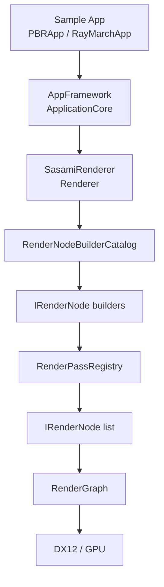
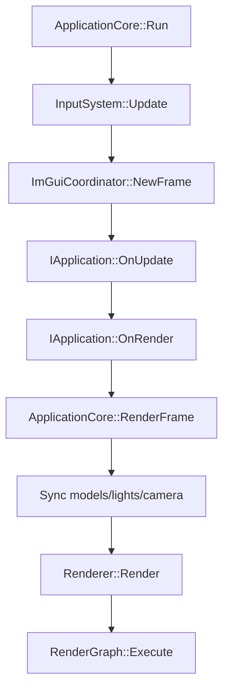

# Sasami DX12 Renderer

DirectX 12 を中心にしたレンダラ実験プロジェクトです。この README は 2026-05-16 時点でリポジトリ内に存在する実装を確認して更新しています。未確認の性能値や対応予定は記載していません。

## Project Status

ソリューションは 4 プロジェクト構成です。

| プロジェクト | 種別 | 役割 |
| --- | --- | --- |
| `SasamiRenderer` | static library | RHI 抽象、DX12 実装、レンダーグラフ、レンダーノード、シーン/ライト/GPU リソース管理 |
| `AppFramework` | static library | Win32 アプリループ、入力、カメラ、簡易 ECS、モデル/アセット読み込み、ImGui 統合 |
| `PBRApp` | executable | Sponza/Bunny/プリミティブを使う PBR サンプル |
| `RayMarchApp` | executable | `RayMarchRenderNode` 単体で動かすレイマーチングサンプル |

現在の既定 RHI は `RHI_DIRECTX12=1` です。`GraphicsDevice.h` には RHI 抽象とバックエンド選択用マクロがありますが、現行実装として確認できる具象デバイスは `Dx12GraphicsDevice` です。

## Implemented Features

- レンダーノード方式の描画パイプライン
  - 既定順序は `Shadow -> Opaque -> RuntimeAO -> Lighting -> Skybox -> TransparentBackfaceDistance -> Transparent -> TransparentLighting -> TransparentComposite -> PostProcess`
  - `AddPass` / `AddPassBefore` / `AddPassAfter` / `ReplacePass` で `IRenderNode` を差し替え可能
  - `RenderNodeBuilderCatalog` が各 `IRenderNode` の生成を担当し、`Renderer` は生成済みノードを登録する
  - `Samples/PBRApp` の ImGui `Rendering` タブに `Render Pass Builder` を追加し、主要パスの有効/無効をリアルタイムに切り替え可能
  - `RenderPassRegistry` が組み込みノードと実行順を管理
- RenderGraph
  - 各ノードが `Setup(RenderGraphBuilder)` で Read/Write/依存を宣言
  - `builder.Read("X")` で宣言したリソースは `PreparePassResources` が自動で `PIXEL_SHADER_RESOURCE` へ遷移（colorTarget/depthTarget 兼用のリソースはスキップ）
  - `ExternalRenderGraphResourceDesc.gpuSrv` でリソースの GPU SRV を登録でき、`RenderGraphExecuteContext::FindResourceSrv()` で参照可能
  - `RenderNodeFrameInputs` に `gbufferAlbedoSrv` / `gbufferNormalSrv` / `gbufferMaterialSrv` / `gbufferEmissiveSrv` を追加
  - `RenderGraph` が依存関係を解決して `Execute(RenderNodeContextView)` を呼び出す
  - 依存はフェーズ順、`DependsOnPrevious()` によるノード依存、Read/Write リソース競合から構築する
  - 同一フェーズ内で依存がないノードは同じ execution level に入り、compute 優先ノードは async compute queue があれば cross-queue fence で同期する
  - `IRenderNode::PreferredQueue()` による Graphics/Compute 希望キュー指定に対応
- Raster/PBR
  - GBuffer、PBR Lighting、Skybox、Transparent/TransparentLighting、PostProcess
  - Tessellation、Geometry Shader、Mesh Shader 用メッシュレット生成と Meshlet Debug View
  - GBuffer Debug View: `FinalLit / Albedo / Normal / Roughness / Metallic / AmbientOcclusion / Shadow / Emissive / Runtime AO Raw / Runtime AO Filtered / DirectionalLight`
- VSM (Variance Shadow Maps)
  - `DirectionalShadowMode::Vsm` (1 cascade) と `Vsm4` (4 cascades) を追加
  - R32G32_FLOAT `Texture2DArray`（最大 4 スライス）に `(depth, depth²)` のモーメントを書き込み
  - Chebyshev 不等式によるソフトシャドウ推定（PCF より高品質でバイリニアフィルタ対応）
  - 分離型ガウスブラー（σ=1.5、7-tap）の H/V パス CS による後処理。GUI で On/Off 切り替え可能
  - `CookTorranceGGX_PS.hlsl` に `SampleShadowVSMCascade()` を追加し、CSM/VSM を `u_vsmParams.x` で分岐
  - ImGui Lighting タブに VSM / VSM4 ラジオボタンと VSM Blur チェックボックスを追加
- Ambient Occlusion
  - Runtime AO はランタイム生成 AO の総称で、現在は SSAO と RTAO（SWRT AO）を選択可能
  - SSAO + bilateral blur
  - RTAO via SWRT
  - `AmbientOcclusionMode`: `MaterialOnly / RuntimeAOOnly / RayTracedAOOnly / Hybrid`
  - `RuntimeAmbientOcclusionMethod`: `SSAO / RayTraced`
  - UE の Min Occlusion 相当の下限値設定
- Software Ray Tracing (SWRT)
  - CPU 構築 BVH/TLAS を GPU にアップロードし、Compute Shader で影・反射・AO を実行
  - Legacy reflection と ReSTIR DI モード
  - Reflection denoiser 設定: temporal alpha、A-Trous iteration、depth phi
  - ReSTIR 関連シェーダ: `SWRT_ReSTIR_*`, `SWRT_Reservoir.hlsli`, `SWRT_Shadow_ReSTIR_CS.hlsl`
  - `SWRT_Reflection_ATrous_CS.hlsl` は作業ツリー上では未追跡ファイルとして存在します
  - エネルギー保存合成: フォワードパス（`CookTorranceGGX_PS.hlsl`）は SWRT 有効時に IBL Specular を 0 として SceneColor に書き込まない。合成パス（`SWRT_ReflectionComposite_PS.hlsl`）は FresnelSchlick を適用した SWRT 結果を加算する（加算ブレンド PSO）。Specular AO は IBL 用のため合成パスには適用しない（SWRT の shadow ray で可視性を物理的に計算済みのため二重カウントになる）
  - レイミス時フォールバック（Legacy パス）: `SWRT_Reflection_CS.hlsl` で反射レイがジオメトリをミスした場合、IBL 有効なら `g_iblPrefilterTex`（cubemap, t9）から roughness ベースの MIP でサンプリング、プロシージャルスカイ有効なら `ComputeSkyColor`（`ProceduralSky/ProceduralSky.hlsli`）を評価して空色を加算する
  - レイミス時フォールバック（ReSTIR パス）: `SWRT_ReSTIR_Initial_CS.hlsl` でミス時に `g_gbufferOut.w = -2.0f`（sentinel）と `g_gbufferOut.xyz = reflDir` を書き込む。`SWRT_ReSTIR_Shade_CS.hlsl` で `depth < -1.5f` を判定し `ComputeSkyColor` でプロシージャルスカイ色を出力する。Temporal/Spatial CS は既存の `depth < 0.0f` 判定でミスピクセルを安全にスキップする
  - `LightCB` に `u_invCameraPV`（カメラ逆行列）を追加し、合成パスで NDC → ワールド座標の再構築と正確な視線ベクトルを計算可能にした
- Hardware Ray Tracing (DXR)
  - `DxrRayTracer` と `RayTracing.hlsl`
  - BLAS/TLAS、RayGen/ClosestHit/Miss/ShadowMiss シェーダ構成
  - `RenderPathMode::HardwareRayTracing` と GPU 対応チェックに基づく実行
- Global Illumination
  - `IrradianceProbeGrid`
  - `GI_ProbeUpdate_CS.hlsl`
  - Probe Grid Debug 表示用 `DebugProbeGridRenderNode`
- Sky / Cloud / Ray Marching
  - HDR/LDR equirect skybox 読み込み
  - LDR cubemap face skybox 読み込み（`px/nx/py/ny/pz/nz` などの 6 面ディレクトリ）
  - `ProceduralSkyRenderNode`
  - `SdfFluidRenderNode` と `RenderPathMode::SdfFluid`
  - `VolumetricCloudRenderNode` と `VolumetricCloud_*` シェーダ。API/UI で有効化すると PBR パスへ自動挿入
  - `RayMarchRenderNode` と `RayMarchApp`。シェーダはリニア HDR を出力し、PostProcess パスの `ToneMap_PS` がトーンマッピングとγ変換を担当する（インラインでの二重適用を排除）
- Asset / Scene
  - glTF 読み込み、WIC 画像読み込み、Radiance HDR 読み込み
  - `StaticModel` の glTF/プリミティブ生成
  - Directional/Point/Spot light と UI ギズモ
- スケルタルアニメーション / GPU スキニング
  - `ModelLoader::LoadGLTFSkinned()` で glTF 2.0 の `skins` / `animations` を読み込み
  - `Skeleton`（最大 128 ボーン、親インデックス、逆バインドポーズ行列）
  - `AnimationController`：T/R/S キーフレームの線形/スレープ補間 + 親→子の階層行列合成
  - `SkinnedMesh_VS.hlsl`：4 ボーンインフルエンス GPU スキニング頂点シェーダ
  - 専用 15 パラメータルートシグネチャ（`cbuffer BoneCB : register(b3)`）と PSO（静的メッシュパイプラインは無変更）
  - `SkinnedRenderProxy` / `Renderer::SubmitSkinnedRenderProxies()` によるフレームごとの骨行列 CB アップロード
  - `RendererFrameCoordinator` に骨行列リングバッファ（1 スロット = 8192 bytes = 128×16×4）を追加

## Architecture

### RenderNodeFrameInputs Decomposition (Phase 4)

`RenderNodeFrameInputs` の 41 フィールドのフラット struct を 6 つの型付きサブ struct に分割しました。

| サブ struct | フィールド | 内容 |
| --- | --- | --- |
| `RenderNodeExecutionContext` | `execution` | cmdList / commandEncoder / pipelineStateCache / srvHeap / viewport / scissorRect / frameCoordinator / frame |
| `RenderNodeCameraData` | `camera` | pv / invPv / pos / right / up / forward / tanHalfFovY / aspectRatio / mode |
| `RenderNodeShadowData` | `shadow` | shadowSrv / spotShadowSrv / vsmSrv |
| `RenderNodeLightingData` | `lighting` | lightSystem / frameLight / lightSrvTable / iblSrvTable / lightCbGpu |
| `RenderNodeGBufferData` | `gbuffer` | albedoSrv / materialSrv / emissiveSrv / normalSrv / depthSrv / depthResource |
| `RenderNodeAoData` | `ao` | aoSrv / screenSpaceAoSrv / ssaoRtv / ssaoResource / ssaoRawSrv / ssaoBlurRtv / ssaoBlurResource / ssaoCbGpu |

グループに属さないフィールド（`skybox`, `reflectionSrv`, `sceneTimeSec`）は引き続き `RenderNodeFrameInputs` の直接メンバーです。呼び出し側は `inputs.execution.cmdList`、`inputs.camera.pv` などのネスト形式でアクセスします。

### Renderer Decomposition (Phase 3)

`Renderer` はシーン同期と環境管理の責務を2つのサブシステムに委譲しています。

| クラス | ファイル | 責務 |
| --- | --- | --- |
| `SceneSynchronizer` | `Source/Renderer/Core/SceneSynchronizer.h/.cpp` | カメラ状態更新、レンダープロキシ送信・クリア、SWRT フレームコンテキスト構築 |
| `EnvironmentManager` | `Source/Renderer/Core/EnvironmentManager.h/.cpp` | スカイボックスデータ設定（HDR/LDR equirect・cubemap face）、IBL テクスチャアップロード、環境アセットリフレッシュ |

どちらも `Renderer` のメンバーへの参照を保持する composition パターンで実装されています。`Renderer` の公開メソッドはそのまま維持され、内部で各サブシステムに委譲します。

### LightSystem Decomposition (Phase 2)

`LightSystem` の GPU シャドウマップリソース管理を `ShadowMapManager` に分離しました。

| クラス | ファイル | 責務 |
| --- | --- | --- |
| `ShadowMapManager` | `Source/Renderer/Scene/ShadowMapManager.h/.cpp` | CSM 深度テクスチャ・スポットシャドウ・VSM リソースの所有と遅延生成（`EnsureXxx`）、DSV/RTV/SRV ヒープ管理、ハンドル提供 |
| `LightSystem` | `Source/Renderer/Scene/LightSystem.h/.cpp` | ライトデータ・CB 管理、シャドウパス実行（`ExecuteShadowPass`）、`BuildShadowPassContext`。シャドウリソースアクセスは `m_shadowMapManager` へ委譲 |

`LightSystem` の公開ゲッター（`GetShadowSrv` / `GetSpotShadowSrv` / `GetVsmSrv`）はインライン委譲として維持され、呼び出し側の変更は不要です。

## RHI Neutral Command Encoder Migration

全レンダーノードを D3D12 直接 API (`CommandList*`) から `IRhiCommandEncoder*` 抽象インターフェースへ移行しました。

### 移行済みノード（`IRhiCommandEncoder*` 使用）

| ノード | 方式 |
| --- | --- |
| `OpaqueRenderNode` / `LightingRenderNode` / `TransparentRenderNode` / `TransparentLightingRenderNode` | `RequireRhiGraphicsBase()` + encoder 経由でレイアウト/PSO/ディスクリプタ/CB バインド |
| `SkyboxRenderNode` → `Skybox::Render()` | encoder 経由で PSO/ディスクリプタ/VB バインドと描画 |
| `ProceduralSkyRenderNode` / `DebugProbeGridRenderNode` | encoder 経由でフルスクリーン描画 / 球体インスタンス描画 |
| `RayMarchRenderNode` / `SdfFluidRenderNode` / `VolumetricCloudRenderNode` | encoder 経由でフルスクリーントライアングル描画 |
| `MeshBuffer::Bind()` / `SkinnedMeshBuffer::Bind()` / `DrawCommandBuilder` | `IRhiCommandEncoder*` に統一 |

### 部分移行（`CommandList*` を保持）

| ノード / 機能 | 理由 |
| --- | --- |
| `SSAORenderNode` | `ResourceBarrier` で生の `ID3D12Resource*` を使用（RHI リソースハンドル未割り当て）|
| `ShadowRenderNode` → `LightSystem::ExecuteShadowPass()` | 深いコールチェーンが `CommandList*` に依存 |
| `MeshShaderRenderNode` (explicit overload) | `ID3D12GraphicsCommandList6::DispatchMesh` が RHI 抽象未対応 |

### インターフェース拡張

`IRhiCommandEncoder` に 14 メソッドを追加（`SetGraphicsPipelineLayout` / `SetDescriptorHeap` / `SetGraphicsDescriptorTable` / `SetGraphicsConstantBufferView` / `SetGraphicsShaderResourceView` / `SetRenderTargets` / `ClearRenderTarget` / `ClearDepthStencil` / `SetVertexBuffers` / `SetIndexBuffer` 等）。`D3D12CommandListRhiEncoder`（Renderer.cpp 内）と `Dx12RhiCommandEncoder`（Dx12GraphicsDevice.cpp 内）の両方に DX12 実装を追加。

`RenderPipelineStateCache` に `MakePipelineHandle` / `MakeLayoutHandle` / `MakeDescriptorHeapHandle` スタティックヘルパを追加し、DX12 ラッパポインタを opaque RHI ハンドルに変換できるようにした。

## Current Caveats

- 現行の既定 RHI は DirectX 12 です。`GraphicsRuntime::Vulkan` / `DirectX11` / `OpenGL` は明示ビルド時に native device/swapchain/frame を初期化し、RHI resource/view/shader/pipeline/command encoder まで持ちます。残りの D3D12 直接 API 使用箇所（SSAO バリア、シャドウパス）の RHI 化は将来作業です。
- 2026-05-25: non-DX12 の feature path 移行は一部進行済みです。`MeshBuffer` / `SkinnedMeshBuffer` は D3D12 互換 Resource がない backend では RHI buffer へアップロードし、`RenderGraph` は RHI RTV/DSV の bind/clear と RHI final transition を行えます。DX11 は RHI SRV/RTV/DSV と vertex/index buffer bind、OpenGL は texture/FBO と vertex/index buffer bind、Vulkan は vertex/index buffer bind まで対応済みです。
- まだ full PBR feature render graph parity ではありません。`RenderPipelineStateCache`、一部 render node の root signature / descriptor table / shader artifact は D3D12 前提が残っています。Vulkan は同一 HLSL パスを動かすには SPIR-V 生成経路も必要です。
- Hardware RT と Mesh Shader は GPU/ドライバ機能に依存します。未対応環境では DXR は Raster へ戻り、Mesh Shader パスはスキップされます。
- `x64 Debug` の `PBRApp.vcxproj` は 2026-05-16 に MSBuild で確認済みです。

## Build

### Requirements

- Windows 10/11
- Visual Studio 2022 / MSVC C++20
- Windows SDK
- Windows Optional Feature の Graphics Tools（D3D12 Debug Layer を使う場合）
- NuGet パッケージ復元
- Boost headers (`boost/signals2`)
  - `BOOST_ROOT` / `BOOST_INCLUDEDIR`
  - またはプロジェクト設定にある `C:\local\boost_1_89_0`
- `Libraries/NRD/_Bin/<Configuration>` に `NRD.lib` / `NRI.lib` があること

### Visual Studio

1. `SasamiRenderer.sln` を開く
2. `x64` + `Debug` または `Release` を選択
3. 実行したいサンプルをスタートアッププロジェクトに設定
   - `PBRApp`
   - `RayMarchApp`
4. `F5` で実行

### MSBuild

Developer Command Prompt で実行します。

```bat
nuget restore SasamiRenderer.sln
msbuild SasamiRenderer.sln /p:Configuration=Debug /p:Platform=x64
```

個別にビルドする場合:

```bat
msbuild PBRApp.vcxproj /p:Configuration=Debug /p:Platform=x64
msbuild RayMarchApp.vcxproj /p:Configuration=Debug /p:Platform=x64
```

出力先は各 `.vcxproj` の設定により `Build/bin/<Platform>/<Configuration>/` です。

### RHI バックエンドビルド設定

`RhiBuild.props` は `SasamiRenderer.vcxproj`、`AppFramework.vcxproj`、
`PBRApp.vcxproj`、`RayMarchApp.vcxproj` から import される共通 MSBuild
設定ファイルです。ローカル生成物ではないため、ソース管理対象として保持します。

既定では DirectX 12 パスをビルドします。

- `RHI_DIRECTX12=1`
- `RHI_DIRECTX11=0`
- `RHI_VULKAN=0`
- `RHI_OPENGL=0`

バックエンド別ビルドは MSBuild プロパティで選択します。

```bat
msbuild SasamiRenderer.sln /p:Configuration=Debug /p:Platform=x64 /p:EnableVulkanBackend=true
msbuild SasamiRenderer.sln /p:Configuration=Debug /p:Platform=x64 /p:EnableDirectX11Backend=true
msbuild SasamiRenderer.sln /p:Configuration=Debug /p:Platform=x64 /p:EnableOpenGLBackend=true
```

これらのスイッチは対応する `RHI_*` プリプロセッサ定義を設定し、non-DX12
ビルドでは既定の DX12 マクロを無効化します。さらにバックエンド固有のライブラリ
を追加し、`Build/bin/x64/Debug/Vulkan/` のように出力先を分離します。Vulkan
ビルドでは `VULKAN_SDK` が必要です。`EnableVulkanBackend=true` が指定され、
`VULKAN_SDK` が未設定の場合は、`RhiBuild.props` が早い段階でビルドを失敗させます。

## 実行

### PBRApp

`PBRApp` は `Samples/PBRApp/RenderingApp.cpp` のサンプルシーンを起動します。

- HDR skybox: `Assets/HDR/citrus_orchard_road_puresky_4k.hdr`
- Models:
  - `Assets/Models/stanford_bunny_pbr/scene.gltf`
  - `Assets/Models/Sponza/glTF/Sponza.gltf`
- 追加プリミティブ:
  - metal sphere
  - metal box
  - transparent sphere
  - transparent box
  - floor
- ImGui:
  - Camera
  - Lighting
  - Render Pass Builder
  - Render settings
  - Material editor
  - GI/Probe debug
  - SWRT/RT 関連設定

### RayMarchApp

`RayMarchApp` は起動時に既定パスをクリアし、`RayMarchRenderNode` だけを登録します。

- Camera mode: `RayMarch`
- UI:
  - camera speed
  - cloud cover / density
  - distance heatmap
  - wave LOD debug
  - cone march debug

## アーキテクチャ

### PBR 透明 / BSDF 状況

SasamiRenderer の標準メッシュ材質は、まだ主に Cook-Torrance GGX BRDF パスです。ラスタ透過は BSDF 方向への初期拡張であり、完全な BTDF/BSDF レンダラーではありません。

現在の挙動:

- static/skinned の透過 draw item は、概算のオブジェクト原点距離で back-to-front に並べます。
- 透過 PBR は lighting path では weighted blended OIT で描画します。`TransparentLightingRenderNode` が `TransparentOitAccum` / `TransparentOitRevealage` に蓄積し、`TransparentCompositeRenderNode` が現在フレームの HDR `SceneColor` copy の上に合成します。
- glTF の transmission、IOR、`KHR_materials_volume` は `SurfaceMaterial` に読み込み、`CookTorranceGGX_PS.hlsl` に渡します。
- transmission は dielectric diffuse energy を減らし、現在フレームの HDR `SceneColor` copy を近似的な透過 radiance として参照します。
- alpha coverage と optical transmission は別制御として扱います。OIT shader は低 alpha の transmissive surface でも完全に消えないように、Fresnel ベースの薄い shell alpha/tint を足して輪郭の存在感を残します。この補正量は `SurfaceMaterial::transparentShellStrength` で material ごとに調整でき、PBR sample の material GUI では `Transparent Shell` として表示します。
- `TransparentBackfaceDistanceRenderNode` は transparent lighting の前に transparent backface を `R32_FLOAT` の camera distance target に描きます。PBR shader は front/back distance delta を screen-space thickness 近似として使います。
- authored thickness または screen-space thickness は、material attenuation color / distance による Beer-Lambert 風の減衰に使います。
- Hardware Ray Tracing path は `DxrRayTracer` の material buffer に alpha / transmission / IOR / transparent shell / volume attenuation を渡します。`RayTracing.hlsl` は radiance ray の closest-hit で alpha/transmission に応じた継続レイを飛ばして背後の radiance と合成します。shadow ray は現状、transparent instance を TLAS instance mask で無視します。
- DXR scene update は material 変更でも AS を再構築します。material 変更は GPU material buffer だけでなく transparent instance mask にも影響し、`UploadSceneBuffers()` が mesh record / BLAS handle を作り直すため、古い TLAS が破棄済み BLAS を参照しないように保守的に同期します。render object の再同期時は旧 GPU resource を破棄する前に GPU idle を待ちます。
- Software RT reflection path は secondary hit の `baseColor.a` と `transmission` を使い、透明面を不透明な hit color として確定せず、薄い surface contribution と奥への継続 ray を合成します。ReSTIR reflection の initial pass では transparent secondary hit を最大 4 層まで抜け、奥の opaque hit または sky miss を reservoir 対象にします。層情報を保持する G-buffer はまだ無いため、ReSTIR では透明層の surface color / transmittance tint を奥の secondary material color に畳み込む近似です。

実装の参考:

- McGuire and Bavoil, "Weighted Blended Order-Independent Transparency", JCGT 2013: additive accum buffer と multiplicative revealage buffer の構成、および weighted blended OIT の合成式。
- NVIDIA Weighted Blended OIT Sample: `RGBA16F` accum と single-channel revealage を使う実装形態。
- Khronos glTF PBR / `KHR_materials_transmission`: alpha coverage と physically-based transmission を分ける材質解釈。
- Microsoft DirectX Raytracing functional spec: any-hit shader は alpha test / transparent shadow 判定に使えるが、不要な場合は opaque として扱う方が高速という DXR 実装上の前提。
- Ray Tracing Gems / common dielectric ray tracing practice: transmissive surface は継続レイまたは refracted ray を生成し、surface response と transmitted radiance を Fresnel/opacity で合成する。

既知の制限:

- true microfacet BTDF integration は未実装です。
- weighted blended OIT は order-independent な近似ですが、正確な multi-layer transparency ではありません。
- backface-derived thickness は screen-space、single-layer、draw-order dependent です。隠れた形状、入れ子 media、ray-traced path length は表しません。
- 現在の screen-space transmission source は近似であり、ray traced refraction とは等価ではありません。
- DXR path の透明 shadow は colored/transmittance shadow ではありません。any-hit / dedicated shadow hit group / opacity micromap は未実装で、transparent object は shadow ray から除外されます。
- DXR path の transmission は single closest-hit 近似です。nested dielectric、正確な enter/exit IOR tracking、caustics、multi-layer absorption は未実装です。
- SWRT reflection の透明処理は material scalar の `baseColor.a` / `transmission` に基づく近似です。texture alpha、正確な屈折 IOR stack、colored transparent shadow、caustics は未実装です。

実行時は 3 層構成です。



フレームの大まかな流れ:



`ApplicationCore` は `SObject` を所有し、`EcsRegistry` に型タグと `ObjectRefComponent` を登録します。モデルとライトは毎フレーム `RenderProxy` / `RenderLightProxy` に変換され、`Renderer` に同期されます。

## 重要ファイル

| パス | 内容 |
| --- | --- |
| `Source/Renderer/Core/Renderer.h/.cpp` | レンダラ本体、ノード登録、フレーム実行、リソース同期 |
| `Source/Renderer/Core/RenderGraph.h/.cpp` | レンダーグラフ、依存解決、実行 |
| `Source/Renderer/Core/RenderNodeBuilder.h/.cpp` | 各 `IRenderNode` の生成と backend capability に基づく利用可否判定 |
| `Source/Renderer/Core/RenderPassRegistry.h/.cpp` | 組み込みノードと実行順管理 |
| `Source/Renderer/Core/RenderFeatureSettings.h` | 描画設定の clamp、排他制御、関連副作用の通知 |
| `Source/Renderer/Core/RhiTypes.h` | Vulkan など他 Graphics API へ広げるための RHI 中立型 |
| `Source/Renderer/Core/RenderSettings.h` | 描画設定の POD |
| `Source/Renderer/Core/RenderTargetPool.h/.cpp` | BackBuffer/GBuffer/Runtime AO/SWRT/RT 用テクスチャ管理 |
| `Source/Renderer/Core/Dx12GraphicsDevice.h/.cpp` | DX12 デバイス、Graphics/Compute queue、swap chain |
| `Source/Renderer/Passes/` | 各 `IRenderNode` 実装 |
| `Source/Renderer/RayTracing/` | SWRT/DXR/シーン加速構造関連 |
| `Source/Renderer/GI/` | Irradiance Probe Grid |
| `Source/Renderer/Scene/` | MeshBuffer、MeshletBuffer、SceneSubmitter、LightSystem、Skybox、AnimationController、SkinnedMeshBuffer |
| `Source/Renderer/Structures/SkinnedVertex.h` | 68 バイトスキニング頂点（位置/法線/色/UV/ボーンインデックス/ウェイト） |
| `Source/Renderer/Structures/Skeleton.h` | ボーン階層・逆バインドポーズ（最大 128 ボーン） |
| `Source/Renderer/Structures/SkeletonAnimation.h` | キーフレームトラック構造体（AnimKeyframe / BoneTrack / SkeletonAnimation） |
| `Source/Renderer/Shaders/` | HLSL シェーダ |
| `Source/AppFramework/` | アプリ基盤、入力、モデルローダ、ImGui、ECS |
| `Samples/PBRApp/` | PBR サンプル |
| `Samples/RayMarchApp/` | レイマーチングサンプル |
| `Assets/` | サンプルモデル、テクスチャ、HDR |
| `Libraries/` | imgui、rapidjson、NRD、DXC など |
| `Tools/DXC/` | 同梱 DXC |

## Shader Layout

- `Source/Renderer/Shaders/CookTorranceGGX_*`: PBR lighting
- `Source/Renderer/Shaders/Opaque_*`: opaque pass
- `Source/Renderer/Shaders/Tessellation_*`: tessellation path
- `Source/Renderer/Shaders/Skybox/`: skybox
- `Source/Renderer/Shaders/SSAO/`: Runtime AO の SSAO 実装と blur
- `Source/Renderer/Shaders/SWRT/`: software ray tracing compute shaders
- `Source/Renderer/Shaders/RayTracing/`: DXR shader
- `Source/Renderer/Shaders/GI/`: GI probe update
- `Source/Renderer/Shaders/Debug/`: debug probe grid, meshlet/tessellation debug shaders
- `Source/Renderer/Shaders/ProceduralSky/`: procedural sky
- `Source/Renderer/Shaders/SdfFluid/`: SDF fluid renderer
- `Source/Renderer/Shaders/RayMarch/`: RayMarch sample
- `Source/Renderer/Shaders/VolumetricCloud/`: volumetric cloud
- `Source/Renderer/Shaders/Shadow/`: VSM シャドウ PS・ガウスブラー CS
- `Source/Renderer/Shaders/SkinnedMesh_VS.hlsl`: GPU スキニング頂点シェーダ（4 ボーンインフルエンス）

## 開発メモ

- 変更前に `git status --short` で作業ツリーを確認してください。現時点では README 以外にも未コミット変更があります。
- `x64/`, `.vs/`, `*.user`, 生成済みバイナリはコミット対象にしない方針です。
- シェーダは Debug/Release の両方で `/WX` 相当の警告エラー扱いを維持してください。
- D3D12 の不具合調査では Debug Layer と GPU-based validation を有効化してください。
## ネイティブバックエンド初期化

DirectX 12 は現在も既定の実行経路です。追加グラフィックス API は
`RhiBuild.props` の明示的なビルド経路として選択します。

- `/p:EnableVulkanBackend=true` は `RHI_VULKAN=1` を設定し、
  `RHI_DIRECTX12` を無効化します。Vulkan SDK の include/library path を追加し、
  `vulkan-1.lib` をリンクします。
- `/p:EnableDirectX11Backend=true` は `RHI_DIRECTX11=1` を設定し、
  `RHI_DIRECTX12` を無効化して `d3d11.lib` をリンクします。
- `/p:EnableOpenGLBackend=true` は `RHI_OPENGL=1` を設定し、
  `RHI_DIRECTX12` を無効化して `opengl32.lib` / `gdi32.lib` をリンクします。

プラットフォーム選択とバックエンド選択は別レイヤーです。`GraphicsDevice.h` は
`PLATFORM_WINDOWS`、`PLATFORM_LINUX`、`PLATFORM_MACOS`、`PLATFORM_ANDROID`
を自動判定し、コンパイル時に少なくとも 1 つの `PLATFORM_*` マクロと 1 つの
`RHI_*` バックエンドマクロが有効であることを要求します。互換性のため、
`PLATFORM_DX12`、`PLATFORM_DX11`、`PLATFORM_VULKAN`、`PLATFORM_OPENGL`
のような旧バックエンドマクロ名も、新しい `RHI_*` マクロの alias として受け付けます。

実装済みのネイティブバックエンド範囲:

- `Source/Renderer/Core/VulkanGraphicsDevice.h/.cpp`: Vulkan instance、
  Win32 surface、physical/logical device、queue、swapchain、command buffer、
  同期、ネイティブ clear/submit/present frame path、capability query。
- `Source/Renderer/Core/Dx11GraphicsDevice.h/.cpp`: D3D11 device/context、
  DXGI swapchain、back-buffer RTV、ネイティブ clear/present frame path、
  capability query。
- `Source/Renderer/Core/OpenGLGraphicsDevice.h/.cpp`: Win32 HDC/WGL context、
  double-buffered pixel format、ネイティブ clear/swap frame path、capability query。
- `RhiTypes.h` に texture、buffer、render-pass attachment、graphics/compute
  pipeline、shader module、backend frame execution 用の API-neutral RHI descriptor。
- `RhiDevice.h` に API-neutral な `IRhiDevice` / `IRhiCommandEncoder` 境界。
  将来の pass が D3D12 / Vulkan / OpenGL / Metal / DX11 のネイティブ
  command/resource 型へ直接依存しないようにするための境界です。
- 対応 macro が有効な場合に `CreateRHIDevice(GraphicsRuntime::...)` で
  DirectX12 / Vulkan / DirectX11 / OpenGL へ routing する runtime factory。

現在の制限: RHI レイヤーはクロスプラットフォームな OS/バックエンド選択マクロを持っていますが、
application/window 統合と確認済みバックエンド実装はまだ Windows/Win32 寄りです。
Vulkan は現在 Win32 surface を作成し、OpenGL は Win32 HDC/WGL を使います。
sample app framework も Win32 input と ImGui platform message を処理します。
non-DX12 バックエンドはまだネイティブ clear/present path が中心ですが、feature render path
移行は開始済みです。static/skinned mesh buffer は neutral RHI buffer へ upload でき、
`RenderGraph` は RHI RTV/DSV descriptor の bind/clear に対応しています。
DX11/OpenGL は RHI descriptor-backed target を bind でき、Vulkan/DX11/OpenGL は
RHI vertex/index buffer bind に対応しています。今後は `RenderPipelineStateCache`、
shader artifact、残りの render-node root-signature/descriptor-table setup を
D3D12-shaped compatibility object から切り離し、その後 non-Win32 window/surface
creation path を追加する必要があります。Linux/macOS/Android の完全な実行時対応は
まだ未完了です。

移行境界は `RhiBackendCapabilities` で明示します。

- `supportsNativeFrame`: backend が native device/swapchain を初期化し、少なくとも
  clear frame を present できる。
- `supportsFeatureRenderPasses`: backend が engine render graph と feature render node
  を実行できる。
- `supportsD3D12CompatibilitySurface`: legacy D3D12 wrapper call が利用できる。
- `supportsRhiResourceCreation` / `supportsRhiDescriptorCreation`: neutral な
  `Rhi*Desc` resource / view creation が実装済み。
- `supportsRhiPipelineCreation`: backend が受け付ける shader input format に対して、
  neutral shader module、pipeline layout、graphics/compute pipeline creation が実装済み。
- `supportsRhiCommandEncoding`: neutral command encoder の作成と submission が実装済み。

DX12 は現在、full feature path と neutral resource/view surface、descriptor allocation /
view creation、shader/layout/pipeline creation、basic command encoding に対応しています。
Vulkan / DX11 / OpenGL は native frame execution に加え、neutral texture/buffer
resource、view、shader module、layout、graphics/compute pipeline handle、pipeline bind、
viewport/scissor、draw indexed、dispatch、submission/flush 用の backend command encoder
を持っています。ただし render-node binding と pass setup が D3D12 wrapper call から
切り離されるまでは、feature pass surface は未対応として扱います。

non-DX12 backend の ImGui は Win32 input/platform のみ初期化します。DX12 ImGui render
backend は `supportsD3D12CompatibilitySurface=true` の場合のみ使います。

Windows x64 バックエンドビルドマトリクスは 2026-05-25 に確認済みです。

| バックエンド | Debug | Release | MSBuild プロパティ | 出力先 |
| --- | --- | --- | --- | --- |
| DirectX 12 | Pass | Pass | default | `Build/bin/x64/<Configuration>/` |
| Vulkan | Pass | Pass | `/p:EnableVulkanBackend=true` | `Build/bin/x64/<Configuration>/Vulkan/` |
| DirectX 11 | Pass | Pass | `/p:EnableDirectX11Backend=true` | `Build/bin/x64/<Configuration>/DirectX11/` |
| OpenGL | Pass | Pass | `/p:EnableOpenGLBackend=true` | `Build/bin/x64/<Configuration>/OpenGL/` |

バックエンド別の出力 directory は意図的な分離です。異なる `RHI_*` マクロでコンパイルされた
incremental object file や library が、バックエンド間で再利用されることを防ぎます。

## Source File Structure (2026-05)

大きなファイルを責務単位に分割しました。

| 旧ファイル | 行数 | 分割後 |
|---|---|---|
| `GpuSoftwareRayTracer.cpp` | 2967 | → `GpuSoftwareRayTracer.cpp` (2113) + `GpuSoftwareBvhBuilder.cpp` (375) + `GpuSoftwarePipelineCache.cpp` (532) |
| `RenderPipelineStateCache.cpp` | 1440 | → `RenderPipelineStateCache.cpp` (840) + `_Effects.cpp` (265) + `_Ssao.cpp` (272) + `_MeshShader.cpp` (256) |
| `Renderer.cpp` | 2036 | → `Renderer.cpp` (1458) + `RendererInitialization.cpp` (391) + `RendererGraphicsCommands.cpp` (284) |
| `ApplicationCore.cpp` | 1447 | → `ApplicationCore.cpp` (1256) + `ApplicationObjectManagement.cpp` (213) |
