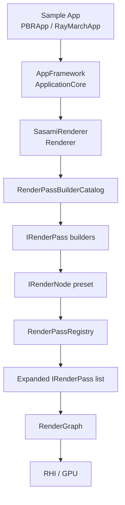
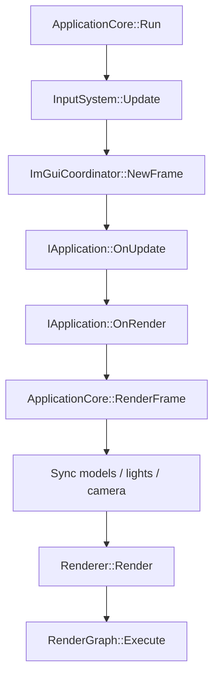

# Sasami DX12 Renderer

Sasami Renderer は DirectX 12 を主軸にした C++20 レンダラ実験プロジェクトです。RHI 抽象、RenderGraph、PBR、シャドウ、透明表現、Software Ray Tracing、DXR、GI、複数バックエンド初期化の検証を同じコードベースで進めています。

この README は 2026-06-07 時点のリポジトリ内容から確認できる情報を基に更新しています。未ビルド・未実行の項目は明示します。

## Project Status

ソリューションは主に 4 プロジェクト構成です。

| プロジェクト | 種別 | 役割 |
| --- | --- | --- |
| `SasamiRenderer` | static library | RHI 抽象、DX12 実装、RenderGraph、レンダーパス、GPU リソース、シーン同期 |
| `AppFramework` | static library | Win32 アプリ基盤、入力、カメラ、ECS、モデル読み込み、ImGui 連携 |
| `PBRApp` | executable | Sponza/Bunny/プリミティブを使う PBR サンプル |
| `RayMarchApp` | executable | `RayMarchRenderPass` と post process を使うレイマーチングサンプル |

既定の RHI は `RHI_DIRECTX12=1` です。`RhiBuild.props` で Vulkan / DirectX 11 / OpenGL を選択できますが、現行のフル機能レンダーパスは DX12 互換サーフェスに強く依存しています。非 DX12 バックエンドは native clear/present と一部 RHI リソース・コマンド実装を持ちますが、DX12 と同等の feature render path は未確認です。

## Implemented Features

- RenderGraph とレンダーパス登録
  - 既定パス順: `Shadow -> Opaque -> RuntimeAO -> RuntimeAOBlur -> Lighting -> SoftwareReflection -> SoftwareReflectionComposite -> Skybox -> TransparentBackfaceDistance -> TransparentSceneColorCopy -> Transparent -> TransparentLighting -> TransparentComposite -> PostProcess`
  - `IRenderPass` が `Setup(RenderGraphBuilder)` で Read/Write/依存関係を宣言し、RenderGraph が実行順を解決します。
  - `IRenderNode` は複数 pass を束ねる preset 単位です。`RenderPassRegistry` が node preset から pass list を展開します。
  - `AddPass` / `AddPassBefore` / `AddPassAfter` / `ReplacePass` / `AddNode` / `SetRenderNodePreset` / `UseDefaultRenderNodePreset` に対応しています。
  - `PBRApp` の ImGui には `Render Node Preset` UI があり、主要パスの有効・無効を切り替えられます。

- Raster / PBR
  - GBuffer、PBR Lighting、Skybox、Transparent、TransparentLighting、TransparentComposite、PostProcess。
  - Tessellation、Geometry Shader、Mesh Shader パスの切り替え。
  - GBuffer Debug View: `FinalLit`, `Albedo`, `Normal`, `Roughness`, `Metallic`, `AmbientOcclusion`, `Shadow`, `Emissive`, `RuntimeAmbientOcclusionRaw`, `RuntimeAmbientOcclusionFiltered`, `DirectionalLightDirection`, `DirectionalLightNdotL`, `ReflectionRadiance`, `ReflectionAlpha`, `SwrtReflectionHitDistance`, `SwrtReflectionComposite`。

- Shadow
  - `DirectionalShadowMode`: `Single`, `Csm4`, `Vsm`, `Vsm4`。
  - VSM は R32G32_FLOAT の texture array に depth / depth squared を書き込みます。
  - `ShadowVSM_GaussBlur_CS.hlsl` は 7-tap separable Gaussian blur を実装しています。

- Ambient Occlusion
  - `AmbientOcclusionMode`: `MaterialOnly`, `RuntimeAOOnly`, `RayTracedAOOnly`, `Hybrid`。
  - `RuntimeAmbientOcclusionMethod`: `SSAO`, `RayTraced`。
  - SSAO と RuntimeAOBlur、SWRT ベースの ray traced AO を切り替えます。

- Software Ray Tracing
  - CPU 側で BVH/TLAS を構築し、GPU compute shader で AO / reflection / ReSTIR 系処理を実行します。
  - 関連 shader は `Source/Renderer/Shaders/SWRT/` にあります。
  - SWRT reflection は透明マテリアルの近似処理を持ちますが、正確な多層屈折や caustics は未実装です。

- Hardware Ray Tracing
  - `RenderPathMode::HardwareRayTracing` と `DxrRayTracer` / `RayTracing.hlsl` が存在します。
  - GPU が対応しない場合は raster path に戻す処理があります。

- Global Illumination
  - `IrradianceProbeGrid`、`GI_ProbeUpdate_CS.hlsl`、`DebugProbeGridRenderPass`。

- Sky / Cloud / Ray Marching
  - HDR/LDR equirect skybox、LDR cubemap face skybox。
  - `ProceduralSkyRenderPass`、`VolumetricCloudRenderPass`。
  - `RayMarchRenderPass` と `RayMarchApp`。

- Asset / Scene
  - glTF、WIC 画像、Radiance HDR の読み込み。
  - Static mesh と skinned mesh。
  - Directional / Point / Spot light と UI 操作。

- Skeletal Animation / GPU Skinning
  - `ModelLoader::LoadGLTFSkinned()` が glTF 2.0 の `skins` / `animations` を読み込みます。
  - `SkinnedMesh_VS.hlsl` が bone matrix CB を使う GPU skinning を担当します。
  - `ApplicationCore::SyncSkinnedModelsToRenderer()` が毎フレーム skinned render proxy を送信します。

## Architecture

### Runtime Flow



### Frame Flow



### RenderPassFrameInputs Decomposition

`RenderPassFrameInputs` は `Source/Renderer/Passes/Core/RenderPassSetupContext.h` にあります。主なサブ構造体は次の通りです。

| struct | 主な内容 |
| --- | --- |
| `RenderPassExecutionContext` | command list / encoder / descriptor heap / viewport / frame coordinator |
| `RenderPassCameraData` | camera matrices, position, basis vectors, projection parameters |
| `RenderPassShadowData` | shadow SRV, spot shadow SRV, VSM SRV |
| `RenderPassLightingData` | light system, frame light, IBL/light SRV tables, light CB |
| `RenderPassGBufferData` | albedo/material/emissive/normal/depth SRV |
| `RenderPassAoData` | AO SRV, SSAO resources, raw/blur resources, AO CB |

### Renderer Decomposition

`Renderer` の責務は一部サブサービスへ分離されています。

| クラス | ファイル | 役割 |
| --- | --- | --- |
| `SceneSynchronizer` | `Source/Renderer/Scene/SceneSynchronizer.h/.cpp` | カメラ CB 更新、render proxy 同期、SWRT frame context 構築 |
| `EnvironmentManager` | `Source/Renderer/Scene/EnvironmentManager.h/.cpp` | skybox 入力、IBL 更新、環境アセット upload |
| `ShadowMapManager` | `Source/Renderer/Scene/ShadowMapManager.h/.cpp` | CSM、spot shadow、VSM の GPU リソースと descriptor 管理 |

### AppFramework Ownership

- `ApplicationCore` はアプリ lifetime、window、renderer 同期、render loop を所有します。
- resource path 解決は `ApplicationResourcePaths` が担当します。
- `SkinnedMeshComponent` は glTF skinned mesh 読み込み、skeleton、animation playback state を所有します。
- `EcsRegistry` は `EntityPreset` 配列で `StaticModel`, `SkinnedModel`, `PointLight`, `SpotLight`, `Camera`, `Generic` を管理します。固定カテゴリの問い合わせは `ViewPreset()` を使います。

## RHI Backend Status

`GraphicsDevice.h` は OS macro と RHI backend macro を分離しています。

- OS macro: `PLATFORM_WINDOWS`, `PLATFORM_LINUX`, `PLATFORM_MACOS`, `PLATFORM_ANDROID`
- RHI macro: `RHI_DIRECTX12`, `RHI_DIRECTX11`, `RHI_VULKAN`, `RHI_OPENGL`
- 旧 macro 名 `PLATFORM_DX12` / `PLATFORM_DX11` / `PLATFORM_VULKAN` / `PLATFORM_OPENGL` は互換 alias として扱われます。

`GraphicsRuntime` は `DirectX12`, `Vulkan`, `DirectX11`, `OpenGL` を持ち、`CreateRHIDevice(GraphicsRuntime)` で backend device を作成します。

`RhiBackendCapabilities` は次の能力フラグを公開します。

- `supportsNativeFrame`
- `supportsFeatureRenderPasses`
- `supportsD3D12CompatibilitySurface`
- `supportsRhiResourceCreation`
- `supportsRhiDescriptorCreation`
- `supportsRhiPipelineCreation`
- `supportsRhiCommandEncoding`
- `supportsHardwareRayTracing`
- `supportsMeshShaders`

現状の読み取り結果:

- DirectX 12 は既定 backend です。ただし `Dx12GraphicsDevice_Init.cpp` 上では `supportsNativeFrame=false` で、既存 renderer は D3D12 compatibility surface を使う設計です。
- Vulkan / DirectX 11 / OpenGL は native frame clear/present path を持ちます。
- 非 DX12 backend の feature render pass parity は未確認です。特に pass setup、root signature / descriptor table、shader artifact 周りは DX12 形状の互換オブジェクトからの分離が残っています。
- Linux / macOS / Android の実行時対応は未完了です。現行 application framework は Win32 入力と Win32 window/surface 前提です。

## Build

### Requirements

- Windows 10/11
- Visual Studio 2022
- Windows 10/11 SDK
- C++20 対応 MSVC
- D3D12 Debug Layer を使う場合は Windows の「Graphics Tools」
- Vulkan backend を有効化する場合は `VULKAN_SDK`

### Visual Studio

1. `SasamiRenderer.sln` を開く。
2. `x64` と `Debug` または `Release` を選択する。
3. `PBRApp` または `RayMarchApp` をスタートアッププロジェクトにする。
4. `F5` で実行する。

### MSBuild

Developer Command Prompt で実行します。

```bat
msbuild SasamiRenderer.vcxproj /p:Configuration=Debug /p:Platform=x64
msbuild SasamiRenderer.vcxproj /p:Configuration=Release /p:Platform=x64
```

サンプルアプリを直接ビルドする場合:

```bat
msbuild PBRApp.vcxproj /p:Configuration=Debug /p:Platform=x64
msbuild RayMarchApp.vcxproj /p:Configuration=Debug /p:Platform=x64
```

### RHI Backend Build Options

`RhiBuild.props` は次の MSBuild property を見ます。

| Backend | Property | 出力サブディレクトリ | 追加依存 |
| --- | --- | --- | --- |
| DirectX 12 | default | none | default |
| Vulkan | `/p:EnableVulkanBackend=true` | `Vulkan\` | `vulkan-1.lib` |
| DirectX 11 | `/p:EnableDirectX11Backend=true` | `DirectX11\` | `d3d11.lib` |
| OpenGL | `/p:EnableOpenGLBackend=true` | `OpenGL\` | `opengl32.lib`, `gdi32.lib` |

例:

```bat
msbuild PBRApp.vcxproj /p:Configuration=Debug /p:Platform=x64 /p:EnableVulkanBackend=true
msbuild PBRApp.vcxproj /p:Configuration=Debug /p:Platform=x64 /p:EnableDirectX11Backend=true
msbuild PBRApp.vcxproj /p:Configuration=Debug /p:Platform=x64 /p:EnableOpenGLBackend=true
```

## Run

- `PBRApp.exe`: PBR、lighting、shadow、AO、reflection、transparent、debug view を操作するメインサンプル。
- `RayMarchApp.exe`: ray marching path のサンプル。

runtime logs と D3D12 debug messages は Visual Studio の Output window で確認してください。

## Important Files

| パス | 内容 |
| --- | --- |
| `Source/Renderer/Runtime/Renderer.h/.cpp` | renderer 本体、pass 登録、frame 実行、リソース同期 |
| `Source/Renderer/Frame/` | frame coordinator / frame orchestration |
| `Source/Renderer/RenderGraph/` | RenderGraph、依存関係解決、実行 node 登録 |
| `Source/Renderer/Passes/Core/` | `IRenderPass`, `IRenderNode`, pass registry, setup context |
| `Source/Renderer/Passes/Geometry/` | shadow / opaque / mesh shader 系 pass |
| `Source/Renderer/Passes/Lighting/` | lighting / SSAO 系 pass |
| `Source/Renderer/Passes/Reflections/` | software reflection と composite pass |
| `Source/Renderer/Passes/Sky/` | skybox / procedural sky / volumetric cloud pass |
| `Source/Renderer/Passes/Transparency/` | transparent、backface distance、lighting、composite、scene color copy |
| `Source/Renderer/Passes/PostProcess/` | post process pass |
| `Source/Renderer/Passes/RayTracing/` | DXR render pass |
| `Source/Renderer/Passes/RayMarch/` | ray marching sample pass |
| `Source/Renderer/Resources/` | render target pool、descriptor allocator、pipeline state cache、shader compilation |
| `Source/Renderer/RHI/` | RHI device / command encoder / neutral descriptor definitions |
| `Source/Renderer/Backends/` | DirectX12 / Vulkan / DirectX11 / OpenGL backend device |
| `Source/Renderer/RayTracing/` | SWRT / DXR / scene acceleration structure |
| `Source/Renderer/GI/` | irradiance probe grid |
| `Source/Renderer/Scene/` | scene synchronization、environment、mesh buffer、light system、skybox、animation |
| `Source/Renderer/Structures/` | renderer data types |
| `Source/Renderer/Shaders/` | HLSL shaders |
| `Source/AppFramework/` | application loop、input、camera、model loading、ImGui、ECS |
| `Samples/PBRApp/` | PBR sample app |
| `Samples/RayMarchApp/` | ray marching sample app |
| `Assets/` | sample models / textures / HDR |
| `Libraries/` | third-party dependencies |
| `Tools/DXC/` | bundled DXC |

## Shader Layout

| ディレクトリ | 内容 |
| --- | --- |
| `Basic/` | basic shader |
| `Common/` | shared shader helpers |
| `Debug/` | debug visualization |
| `Denoising/` | NRD integration include |
| `GI/` | probe update / SH helper |
| `MeshShader/` | mesh shader path |
| `Opaque/` | opaque pass |
| `PBR/` | PBR lighting / BRDF / IBL / shadow / SSR helpers |
| `PostProcess/` | tone mapping / post process |
| `ProceduralSky/` | procedural sky |
| `RayMarch/` | ray marching sample shaders |
| `RayTracing/` | DXR shaders |
| `Shadow/` | shadow and VSM shaders |
| `SkinnedMesh/` | GPU skinning shaders |
| `Skybox/` | skybox shaders |
| `SSAO/` | SSAO and blur |
| `SWRT/` | software ray tracing compute shaders |
| `Tessellation/` | tessellation path |
| `Transparent/` | transparent rendering |
| `VolumetricCloud/` | volumetric cloud |

## Current Caveats

- この更新ではローカルビルドとランタイム描画確認は実行していません。
- 非 DX12 backend は native clear/present と一部 RHI surface を持ちますが、フル feature path の同等性は未確認です。
- DXR path の透明 shadow は colored/transmittance shadow ではありません。any-hit / dedicated transparent shadow hit group / opacity micromap は未実装です。
- transparent path は screen-space / single-layer / draw-order dependent な近似を含みます。nested dielectric、正確な IOR stack、caustics、multi-layer absorption は未実装です。
- SWRT reflection の透明処理は material scalar に基づく近似です。texture alpha、正確な多層 IOR、colored transparent shadow、caustics は未実装です。

## Development Notes

- 変更前に作業ツリーを確認してください。この環境では `git status` がポリシーで使えない場合があります。
- `x64/`, `.vs/`, `*.user`, 生成済みバイナリはコミット対象にしないでください。
- renderer / graphics API / shader / lighting / ray tracing / GI / material / render graph の変更では、事前に短い実装計画と参照元を残してください。
- 参照元には、公式 API 仕様、ベンダーサンプル、論文、Unreal Engine などの実績ある実装、メンテされている open-source renderer を優先してください。
- 互換性のないライセンスのコードはコピーしないでください。設計や挙動の参考に留め、このコードベースのスタイルで実装してください。
- shader は Debug / Release の両方で warning-as-error 相当を維持する方針です。
- D3D12 不具合調査では Debug Layer と GPU-based validation を有効にしてください。

## Source File Structure Notes

大きなファイルは段階的に分割されています。

| 旧ファイル | 現在の分割先 |
| --- | --- |
| `GpuSoftwareRayTracer.cpp` | `GpuSoftwareRayTracer.cpp`, `GpuSoftwareBvhBuilder.cpp`, `GpuSoftwarePipelineCache.cpp` |
| `RenderPipelineStateCache.cpp` | `RenderPipelineStateCache.cpp`, `_Effects.cpp`, `_Ssao.cpp`, `_MeshShader.cpp` |
| `Renderer.cpp` | `Renderer.cpp`, `RendererInitialization.cpp`, `RendererGraphicsCommands.cpp`, `Renderer_Render.cpp` |
| `ApplicationCore.cpp` | `ApplicationCore.cpp`, `ApplicationObjectManagement.cpp`, `ApplicationResourcePaths.cpp`, `ApplicationCore_Properties.cpp` |
